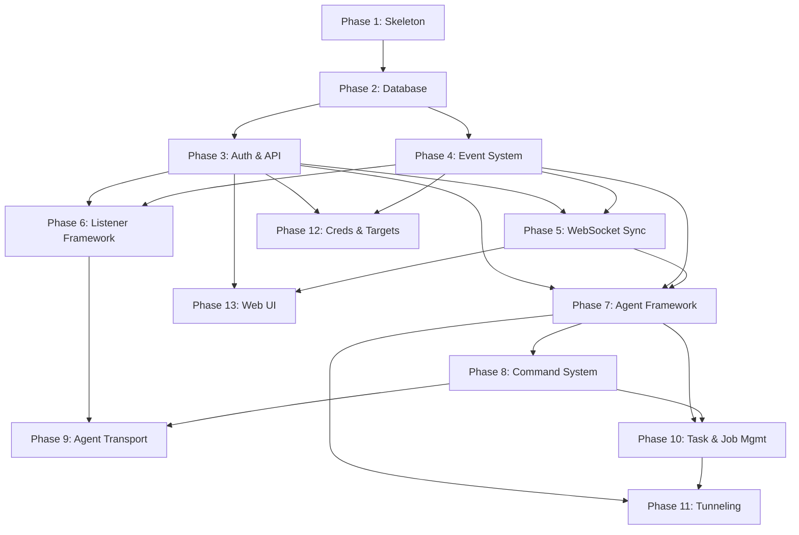

# Practical Execution Pattern

Don't run this as one giant prompt. Structure it as per-document API calls in dependency order:

1. Read all 6 reference specs → write 01 (thinking: high) →
2. write 02 (thinking: medium, context: 01) →
3. write 03 (thinking: light, context: 01+02) →
4. ...write 07 (thinking: high, context: 01–06)

Each call gets the previously written docs as context. This avoids context exhaustion and lets you inspect/correct before proceeding to dependent docs.

---

# Spec-Driven Design: ExecuteC2 Framework

## Context

You are creating a complete spec-driven design (SSD) for **ExecuteC2** — a Python-based post-exploitation C2 framework for authorized red team operations and security research.

### Reference Material (input only)

Read all `docs/ssd/` files before designing:

- `01_ARCHITECTURE.md` — System overview, components, data flow diagrams
- `03_API_REFERENCE.md` — REST endpoints + WebSocket sync protocol
- `02_DATA_MODELS.md` — Data structures, database schemas, wire formats
- `06_CONFIG_SPEC.md` — Configuration schemas, runtime constants
- `04_PROTOCOL_SPEC.md` — Agent wire protocols
- `05_AGENT_SPEC.md` — Plugin system, agent lifecycle, event system

**CRITICAL: The output SSD files must be entirely self-contained ExecuteC2 specifications. Do NOT reference, cite, or mention any external material or its source in any output document.**

## What ExecuteC2 Is

ExecuteC2 is a **Python-first** C2 framework. Python is the implementation language for everything: teamserver, agent, plugins, tooling, tests, and deployment scripts.

| Aspect | ExecuteC2 |
| --- | --- |
| Language | Python 3.12+ (asyncio throughout) |
| Client interface | Web UI + REST API + CLI |
| Database | SQLite (WAL) via aiosqlite |
| Plugin system | Python plugin modules (importlib) |
| Agent | Python agent (cross-platform) |
| Scripting/extensions | Native Python (no separate engine) |
| Transport encryption | AES-GCM / ChaCha20-Poly1305 |
| WebSocket | FastAPI WebSocket |
| HTTP framework | FastAPI |
| Auth | JWT (HMAC-SHA256) |

### Runtime Requirements

- Python >= 3.12
- FastAPI >= 0.115
- aiosqlite >= 0.20
- PyJWT >= 2.9
- cryptography >= 44.0
- msgpack >= 1.1
- uvicorn >= 0.34
- pydantic >= 2.10
- structlog >= 24.4 (structured logging)
- pytest >= 8.3 (testing)
- pytest-asyncio >= 0.24 (async test support)
- httpx >= 0.28 (async HTTP client for FastAPI testing)

### Key Design Decisions to Make

Spec docs must state each decision and rationale:

1. **Async architecture** — How deeply does asyncio penetrate? (recommended: fully async, every I/O operation)
2. **Agent communication model** — Async HTTP polling vs persistent WebSocket connection vs both?
3. **Plugin interface** — Python ABC classes vs protocol classes vs hook-based?
4. **Task serialization** — msgpack vs JSON vs custom format?
5. **Tunnel implementation** — asyncio streams for SOCKS/portfwd?
6. **Multi-operator sync** — WebSocket broadcast pattern with backpressure?
7. **Agent payload strategy** — Raw Python script (requires Python on target), PyInstaller/Nuitka compiled binary (standalone, ~20MB+), or minimal stager that downloads full agent? Document trade-offs for each.
8. **Event system** — Pre/post hooks with cancellation? asyncio task pool or simple dispatch? Priority ordering?

## Scope — v1.0

### In Scope

- HTTP/S listener + polling agent
- Single teamserver, multi-operator
- Task/job lifecycle, command dispatch
- SOCKS5 tunneling, local port forwarding
- Credential and target tracking
- WebSocket sync + REST API
- Docker deployment
- Event system with pre/post hooks
- Python plugin interface for listeners and agents
- Structured logging (structlog) with operator audit trail

### Out of Scope (v2+)

- DNS/SMB/TCP listener protocols
- Agent pivoting (parent/child relay)
- Reverse port forwarding
- GUI client (Web UI only)
- Agent compilation/obfuscation pipeline (v1 ships raw Python agent)
- BOF execution
- Interactive terminal sessions

### OPSEC / Security Design

The specs must address these in `01_ARCHITECTURE.md` under a dedicated Security section:

- **Traffic blending** — Configurable HTTP profiles (URIs, headers, user-agents, response templates) for malleable C2 patterns
- **Encryption key management** — Per-listener keys, key derivation, no key reuse across listeners
- **Teamserver hardening** — TLS required, rate limiting on auth endpoints, operator audit log (who did what, when)
- **Structured logging** — All teamserver components use structlog with JSON output; every operator action, agent check-in, and state change is logged with context (operator, agent_id, timestamp); log levels: DEBUG for protocol detail, INFO for operations, WARNING for anomalies, ERROR for failures
- **Agent anti-analysis** — Explicitly out of scope for v1; document as future work
- **Credential storage** — Secrets at rest encryption in SQLite

## Target Repository Layout

```text
executec2/
├── pyproject.toml
├── src/executec2/
│   ├── __init__.py
│   ├── __main__.py              # CLI entry point
│   ├── server/
│   │   ├── __init__.py
│   │   ├── app.py               # FastAPI application factory
│   │   ├── auth.py              # JWT + operator management
│   │   ├── database.py          # aiosqlite layer + schema
│   │   ├── broker.py            # WebSocket message broker
│   │   ├── events.py            # Event manager (pre/post hooks)
│   │   ├── models.py            # Pydantic models
│   │   └── routes/              # FastAPI route modules
│   │       ├── __init__.py
│   │       ├── agents.py
│   │       ├── listeners.py
│   │       ├── tasks.py
│   │       ├── tunnels.py
│   │       ├── credentials.py
│   │       ├── targets.py
│   │       └── sync.py
│   ├── listeners/               # Listener plugin implementations
│   │   ├── __init__.py
│   │   ├── base.py              # Listener ABC
│   │   └── http_listener.py     # HTTP/S listener
│   ├── agents/                  # Agent plugin definitions
│   │   ├── __init__.py
│   │   ├── base.py              # Agent plugin ABC
│   │   └── python_agent.py      # Python agent plugin
│   ├── commands/                # Command registry + built-ins
│   │   ├── __init__.py
│   │   ├── registry.py
│   │   └── builtin/
│   │       └── __init__.py
│   ├── tunnels/                 # SOCKS/portfwd implementation
│   │   ├── __init__.py
│   │   └── socks5.py
│   └── config/                  # Configuration schemas
│       ├── __init__.py
│       └── schema.py
├── agent/                       # Standalone Python agent payload
│   ├── __init__.py
│   ├── main.py                  # Agent entry point
│   ├── connector_http.py        # HTTP/S transport
│   ├── crypto.py                # AES-GCM encryption
│   └── commands/                # Agent-side command handlers
│       └── __init__.py
├── tests/
│   ├── unit/
│   │   └── __init__.py
│   ├── integration/
│   │   └── __init__.py
│   └── conftest.py
└── docker/
    ├── Dockerfile
    └── docker-compose.yml
```

The specs MUST use these paths. Do not invent alternative layouts.

## Deliverables

Create the following files in `docs/ssd/`:

### Tier 1 — Core Architecture (write these first)

| File | Purpose | Key Sections |
| --- | --- | --- |
| `01_ARCHITECTURE.md` | System design and component relationships | Component diagram (Mermaid), startup sequence, data flow for agent check-in and operator commands, technology stack with version pins, repository layout, security section |
| `02_DATA_MODELS.md` | All data structures and schemas | Pydantic models for Agent, Task, Listener, Credential, Target; SQLite CREATE TABLE statements; WebSocket packet type enum; serialization formats |
| `03_API_REFERENCE.md` | Complete HTTP + WebSocket API | Every endpoint with method, path, auth, request/response body, error codes; WebSocket frame format; subscription categories; OTP system |

### Tier 2 — Protocols and Agents (depend on Tier 1)

| File | Purpose | Key Sections |
| --- | --- | --- |
| `04_PROTOCOL_SPEC.md` | Wire protocols between agents and teamserver | HTTP/S check-in protocol, encryption scheme (AES-GCM), beat/registration format, task serialization, response embedding |
| `05_AGENT_SPEC.md` | Agent architecture and lifecycle | Agent state machine (Active/Inactive/Disconnect/Terminated), plugin interface (Python ABCs), command dispatch, supported commands table with IDs, connector/transport abstraction |
| `06_CONFIG_SPEC.md` | All configuration schemas | Server config (YAML), listener configs, agent build configs, runtime constants table (queue sizes, timeouts, intervals), environment variables |

### Tier 3 — Implementation (depend on Tier 1 + 2)

| File | Purpose | Key Sections |
| --- | --- | --- |
| `07_IMPLEMENTATION_PLAN.md` | Phased build plan | See format requirements below |
| `08_TEST_SPEC.md` | Testing strategy (pytest) | Unit test boundaries, integration test setup, mock boundaries, E2E scenarios (agent check-in, command execute, tunnel setup) |
| `09_DEPLOYMENT_SPEC.md` | Docker + runtime setup | Dockerfile, docker-compose.yml, ports, volumes, development vs production configs |

### Index File

| File | Purpose |
| --- | --- |
| `README.md` | Index linking all spec files with one-line descriptions |

## Execution Order

Write in this order. Complete each fully. No placeholders — every file must be final quality.

1. Review existing SSD docs in `docs/ssd/`
2. Write `01_ARCHITECTURE.md` — this anchors everything
3. Write `02_DATA_MODELS.md` — concrete Python types that all other specs reference
4. Write `03_API_REFERENCE.md` — must reference models from step 3
5. Write `04_PROTOCOL_SPEC.md` + `05_AGENT_SPEC.md` + `06_CONFIG_SPEC.md`
6. Write `07_IMPLEMENTATION_PLAN.md` — must reference all above
7. Write `08_TEST_SPEC.md` + `09_DEPLOYMENT_SPEC.md`
8. Write `README.md` index
9. Run validation checklist

## Implementation Plan Format (07_IMPLEMENTATION_PLAN.md)

Structure as **phases with explicit dependencies**:

### Phase Structure

```markdown
## Phase N: <Name> [depends on: Phase X, Y]

### Goal
One sentence: what is true when this phase is done?

### Files to Create/Modify
- `path/to/file.py` — purpose

### Steps
1. Step description
   - Exact file path
   - Key interfaces/classes to implement
   - Validation: how to verify this step works

### Exit Criteria
- [ ] Concrete, testable condition
- [ ] Another condition
```

### Required Phases (minimum)

1. **Project Skeleton** — pyproject.toml, directory structure, deps, basic CLI entry point
2. **Database Layer** — aiosqlite, schema creation, CRUD operations for all models
3. **Auth & HTTP API** — FastAPI app, JWT auth, login/refresh endpoints
4. **Event System** — Event manager, pre/post hooks, async dispatch
5. **WebSocket Sync** — Connection manager, message broker, sync protocol, subscriptions
6. **Listener Framework** — Plugin loader, listener ABC, HTTP/S listener implementation
7. **Agent Framework** — Agent model, lifecycle state machine, task queue, tick updater
8. **Command System** — Command dispatch, command registry, built-in commands
9. **Agent Transport** — Python agent payload, HTTP connector, encryption, check-in loop
10. **Task & Job Management** — Task types, job lifecycle, task routing
11. **Tunneling** — SOCKS5 proxy, local port forwarding, tunnel data channels
12. **Credential & Target Management** — CRUD + event broadcast
13. **Web UI** — Operator dashboard (can be deferred)

### Phase Dependency Graph



Each phase fits one session. Steps must be granular enough to implement without ambiguity.

## Document Size Guidance

Target sizes (prevents shallow specs and context exhaustion):

| File | Target Lines | Notes |
| --- | --- | --- |
| `01_ARCHITECTURE.md` | 300–500 | Diagrams + prose; anchor document |
| `02_DATA_MODELS.md` | 400–600 | Pydantic models + SQL schemas are verbose |
| `03_API_REFERENCE.md` | 300–500 | Every endpoint, but keep format compact |
| `04_PROTOCOL_SPEC.md` | 200–350 | HTTP/S only for v1; focused |
| `05_AGENT_SPEC.md` | 300–450 | State machine + command table + ABCs |
| `06_CONFIG_SPEC.md` | 200–300 | YAML schemas + constants table |
| `07_IMPLEMENTATION_PLAN.md` | 400–600 | Most critical; 13 phases with steps |
| `08_TEST_SPEC.md` | 200–300 | Test matrix + fixture patterns |
| `09_DEPLOYMENT_SPEC.md` | 150–250 | Docker configs are compact |

If a spec exceeds its upper bound, split content into cross-references rather than inlining everything.

## Testing Stack

All tests use pytest with these specifics:

| Aspect | Detail |
| --- | --- |
| Framework | pytest >= 8.3 + pytest-asyncio >= 0.24 |
| HTTP testing | httpx AsyncClient with FastAPI TestClient |
| Async mode | pytest-asyncio `auto` mode |
| Fixtures | `@pytest_asyncio.fixture` for db, app client, mock agent |
| Structure | `tests/unit/` mirrors `src/executec2/`; `tests/integration/` for multi-component |
| Coverage | 80%+ server core, 60%+ agent payload |

`08_TEST_SPEC.md` must define:

- Fixture hierarchy (database -> app -> authenticated client -> agent)
- Mock boundaries (what gets mocked in unit vs hit in integration)
- Concrete test scenarios per phase (not generic "test the API")
- Example test function signatures showing the async pattern

## Spec Document Standards

Every spec file must include:

```yaml
---
version: 1.0.0
date: 2026-03-17
project: ExecuteC2
language: Python 3.12+
---
```

### Content Requirements

- **Mermaid diagrams** for all component relationships and data flows
- **Concrete types** — no "various fields" or "relevant data"; specify every field
- **Python code examples** — type annotations, Pydantic model definitions, ABC interfaces, not pseudocode
- **Cross-references** — Link between spec docs (e.g., "See DATA_MODELS.md#agent-model")
- **All code must be Python** — no Go, C++, JavaScript, or other languages in specs or examples

### What NOT to Include

- No aspirational features — only spec what is listed in the v1.0 scope above
- No duplicated content between spec files — reference instead
- No placeholder sections — if it's not designed yet, don't include it
- No out-of-scope features (DNS/SMB/TCP listeners, pivoting, BOF, etc.)
- No code examples in any language other than Python

## Validation Checklist

Before considering the SSD complete, verify:

- [ ] Every SQLite table in DATA_MODELS.md has corresponding CRUD in API_REFERENCE.md
- [ ] Every API endpoint has a request/response schema defined in DATA_MODELS.md
- [ ] Every WebSocket packet type is used by at least one component
- [ ] Every agent command in AGENT_SPEC.md has a task type in DATA_MODELS.md
- [ ] Every listener type in CONFIG_SPEC.md has a protocol in PROTOCOL_SPEC.md
- [ ] IMPLEMENTATION_PLAN.md phases cover 100% of the components in ARCHITECTURE.md
- [ ] TEST_SPEC.md has at least one test scenario per phase in IMPLEMENTATION_PLAN.md
- [ ] No circular dependencies between phases
- [ ] Every phase in IMPLEMENTATION_PLAN.md lists concrete file paths that exist in the repository layout
- [ ] No spec references an out-of-scope feature
- [ ] PROTOCOL_SPEC.md encryption scheme matches CONFIG_SPEC.md key formats
- [ ] Agent state transitions in AGENT_SPEC.md are exhaustive (every state has defined transitions)
- [ ] All code examples are Python — zero non-Python code in any spec
- [ ] No spec file references the source reference material
