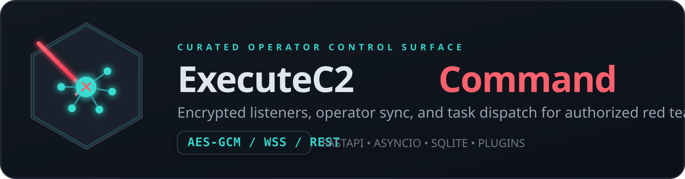

# ExecuteC2



**Version: 0.9** | Python 3.12+ | FastAPI | asyncio | SQLite

A Python-based C2 (command and control) teamserver for authorized red team operations, built on a Python/FastAPI/asyncio stack.

> **For authorized use only.** This tool is designed for legitimate penetration testing and red team engagements under explicit written authorization.

---

## Overview

ExecuteC2 provides a full teamserver with:

- **HTTPS REST API** — JWT-authenticated endpoints for agents, listeners, tasks, credentials, targets, and tunnels
- **Operator WebSocket sync** — Real-time operator client synchronization via a fan-out message broker
- **Agent transports** — encrypted HTTP polling and persistent WebSocket agent communication
- **Plugin system** — Listener and agent plugins loaded via Python `importlib` with defined ABCs
- **Agent lifecycle** — State machine tracking Active → Inactive → Disconnect → Terminated transitions
- **Task/result routing** — Async task dispatch with end-to-end result ingestion and task state updates
- **Interactive sessions** — shell, SOCKS, and local port-forward workflows over a multiplexed session backbone
- **Transport integrity** — AES-GCM encryption plus signed envelopes for task, result, and session frames
- **SQLite persistence** — All state stored in WAL-mode SQLite via `aiosqlite`

---

## Repository Structure

```text
ExecuteC2/
├── src/executec2/          # Teamserver package (installed as `executec2`)
│   ├── __main__.py         # CLI entry point (argparse → run_server)
│   ├── __init__.py         # Package version
│   ├── config/
│   │   └── schema.py       # Pydantic config models (ServerConfig, etc.)
│   ├── server/
│   │   ├── app.py          # FastAPI app factory + lifespan
│   │   ├── teamserver.py   # TeamserverCore: agent lifecycle, tick loop
│   │   ├── database.py     # aiosqlite DBMS wrapper + schema init
│   │   ├── broker.py       # MessageBroker: asyncio fan-out to operator clients
│   │   ├── events.py       # EventManager: internal event bus
│   │   ├── auth.py         # JWTManager, OTPStore, RateLimiter
│   │   ├── session_manager.py # Interactive session lifecycle + stream relay
│   │   ├── models.py       # Pydantic + dataclass models (Agent, Task, etc.)
│   │   └── routes/         # FastAPI routers
│   │       ├── auth.py     # POST /api/auth/login, /refresh, /logout
│   │       ├── agents.py   # Agent CRUD + task submission
│   │       ├── listeners.py# Listener start/stop/list
│   │       ├── sessions.py # Shell/session APIs + session WS attach
│   │       ├── tasks.py    # Task list/output
│   │       ├── credentials.py
│   │       ├── targets.py
│   │       ├── tunnels.py
│   │       ├── sync.py     # WebSocket /ws/sync endpoint
│   │       └── chat.py     # Operator chat
│   ├── transport.py        # Shared HKDF/AES/HMAC transport helpers
│   ├── agents/
│   │   ├── base.py         # AgentPlugin ABC
│   │   └── python_agent.py # Built-in Python agent plugin
│   ├── listeners/
│   │   ├── base.py         # ListenerPlugin ABC
│   │   └── http_listener.py# HTTP/S listener plugin
│   │   └── websocket_listener.py # Persistent WebSocket agent listener
│   ├── commands/
│   │   ├── registry.py     # Command registry + dispatch
│   │   └── builtin/        # Built-in command implementations
│   └── tunnels/
│       └── socks5.py       # SOCKS5 frontend for agent-backed sessions
│
├── agent/                  # Standalone agent payload (runs on target)
│   ├── main.py             # Agent entry point + HTTP / WebSocket runtime
│   ├── connector_http.py   # HTTP transport connector
│   ├── connector_ws.py     # WebSocket transport connector
│   ├── crypto.py           # AES-GCM encryption helpers
│   └── commands/           # Agent-side command handlers
│
├── tests/
│   ├── conftest.py         # Shared pytest fixtures (app, db, auth tokens)
│   ├── unit/               # Unit tests per module
│   └── integration/        # Integration tests (API auth, agents, listeners, WebSocket)
│
├── docs/
│   ├── ssd/                # ExecuteC2 spec-driven design documents (9 files)
│   └── specs/              # Reference architecture specs
│
├── docker/                 # Docker + compose files (see deployment spec)
├── pyproject.toml          # Project metadata, dependencies, tool config
└── CLAUDE.md               # AI assistant instructions for this project
```

---

## Prerequisites

- **Python 3.12+**
- **[uv](https://docs.astral.sh/uv/)** (recommended package manager) or `pip`
- A TLS certificate and private key (required by the server config)
- OpenSSL (for generating self-signed certs in development)

---

## Installation

### 1. Clone the repository

```bash
git clone <repo-url> ExecuteC2
cd ExecuteC2
```

### 2. Create a virtual environment and install dependencies

```bash
# Using uv (recommended)
uv venv
uv pip install -e ".[dev]"

# Or using pip
python -m venv .venv
source .venv/bin/activate
pip install -e ".[dev]"
```

### 3. Generate a self-signed TLS certificate (development only)

```bash
openssl req -x509 -newkey rsa:2048 \
  -keyout key.pem -out cert.pem \
  -days 365 -nodes -subj "/CN=executec2"
```

### 4. Create a `config.yaml`

```yaml
server:
  host: "0.0.0.0"
  port: 4321
  data_dir: "./data"
  tls_cert: "./cert.pem"
  tls_key: "./key.pem"

operators:
  admin: "changeme"

plugins:
  listeners:
    - "executec2.listeners.http_listener"
    - "executec2.listeners.websocket_listener"
  agents:
    - "executec2.agents.python_agent"

logging:
  level: "INFO"
  format: "json"
```

---

## Usage

### Run the teamserver

```bash
# Using the installed entry point
uv run executec2 --config config.yaml

# Or as a module
uv run python -m executec2 --config config.yaml

# With debug logging
uv run executec2 --config config.yaml --debug

# Override bind address / port at runtime
uv run executec2 --config config.yaml --host 127.0.0.1 --port 8443
```

The server starts an HTTPS API + WebSocket endpoint at `https://<host>:<port>`.

### Available listener transports

- `http` — encrypted polling transport with signed result envelopes
- `websocket` — persistent low-latency agent transport with session multiplexing

### Session APIs

- `POST /api/agents/{agent_id}/shell` — create a shell session
- `GET /api/sessions` — list active and recent sessions
- `POST /api/sessions/{session_id}/stop` — terminate a session
- `POST /api/auth/otp` with `type=session` — mint an OTP for session attachment
- `GET /api/sessions/ws?otp=...&session_id=...` — operator bidirectional session socket

### CLI flags

| Flag              | Default       | Description                                |
| ----------------- | ------------- | ------------------------------------------ |
| `--config`, `-c`  | `config.yaml` | Path to config file (`EC2_CONFIG` env var) |
| `--host`          | from config   | Override bind address (`EC2_HOST`)         |
| `--port`, `-p`    | from config   | Override listen port (`EC2_PORT`)          |
| `--debug`         | false         | Enable DEBUG logging (`EC2_DEBUG=1`)       |
| `--version`, `-v` | —             | Print version and exit                     |

### Environment variable overrides

| Variable        | Effect                                       |
| --------------- | -------------------------------------------- |
| `EC2_CONFIG`    | Config file path                             |
| `EC2_HOST`      | Bind address                                 |
| `EC2_PORT`      | Listen port                                  |
| `EC2_DEBUG`     | Enable debug logging (`1`, `true`, or `yes`) |
| `EC2_DATA_DIR`  | Override `server.data_dir`                   |
| `EC2_TLS_CERT`  | Override `server.tls_cert`                   |
| `EC2_TLS_KEY`   | Override `server.tls_key`                    |
| `EC2_LOG_LEVEL` | Override `logging.level`                     |

### Run tests

```bash
uv run pytest tests/                              # all tests
uv run pytest tests/unit/                         # unit tests only
uv run pytest tests/integration/                  # integration tests only
uv run pytest tests/unit/test_auth.py::test_login # single test
uv run pytest --cov                               # with coverage report
```

### Lint and format

```bash
uv run ruff check .    # lint
uv run ruff format .   # format
```

---

## Configuration

`config.yaml` schema.

Key fields:

| Field                      | Default   | Description                            |
| -------------------------- | --------- | -------------------------------------- |
| `server.host`              | `0.0.0.0` | Bind address                           |
| `server.port`              | `4321`    | HTTPS + WebSocket port                 |
| `server.data_dir`          | `./data`  | SQLite database and download storage   |
| `server.tls_cert`          | —         | TLS certificate path (required)        |
| `server.tls_key`           | —         | TLS private key path (required)        |
| `server.access_token_ttl`  | `24`      | Access token lifetime (hours)          |
| `server.refresh_token_ttl` | `168`     | Refresh token lifetime (hours, 7 days) |
| `server.auth_rate_limit`   | `10`      | Max auth attempts per IP per minute    |
| `server.max_task_payload_bytes` | `8388608` | Max serialized task payload size |
| `operators`                | —         | `username: password` map               |

Listener-specific config examples:

```yaml
listeners:
  - listener_name: "http1"
    listener_type: "http"
    config:
      host_bind: "0.0.0.0"
      port_bind: 8080
      callback_addresses: ["c2.example.com"]
      encrypt_key: "<64 hex chars>"
      uris: ["/check"]
      beat_header: "X-Beat"

  - listener_name: "ws1"
    listener_type: "websocket"
    config:
      host_bind: "0.0.0.0"
      port_bind: 8443
      callback_addresses: ["c2.example.com:8443"]
      encrypt_key: "<64 hex chars>"
      path: "/agent/ws"
      ssl: true
      ssl_cert: "./cert.pem"
      ssl_key: "./key.pem"
```

## Testing status

Current baseline on `main`:

```text
265 passed, 9 xfailed
```

The `xfail` cases are known placeholders for legacy or not-yet-finished scenarios:

- Phase 9 HTTP check-in integration placeholders
- Phase 10 task manager / job progress placeholders
- Phase 10 task routing via REST placeholder
- Phase 11 tunnel stop cleanup placeholder

---

## Security

This software is designed for **authorized penetration testing and red team operations only**. Usage against systems without explicit written authorization is illegal. The operators are responsible for ensuring all use complies with applicable laws and engagement rules of engagement.

TLS is required for all API and WebSocket communication. Use properly signed certificates in production environments — do not use self-signed certificates against real targets.
