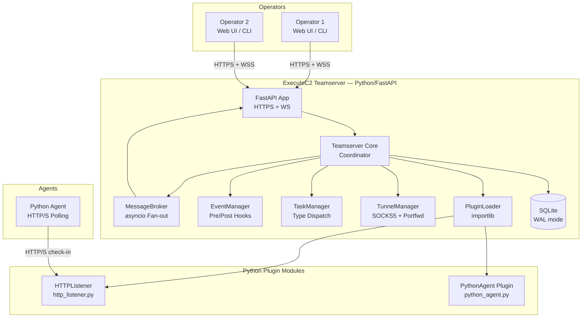
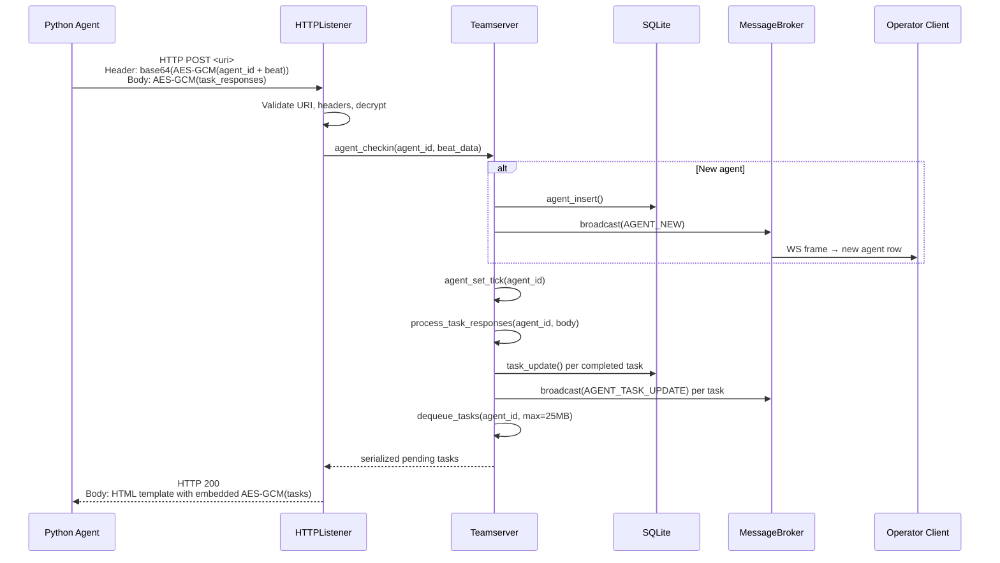
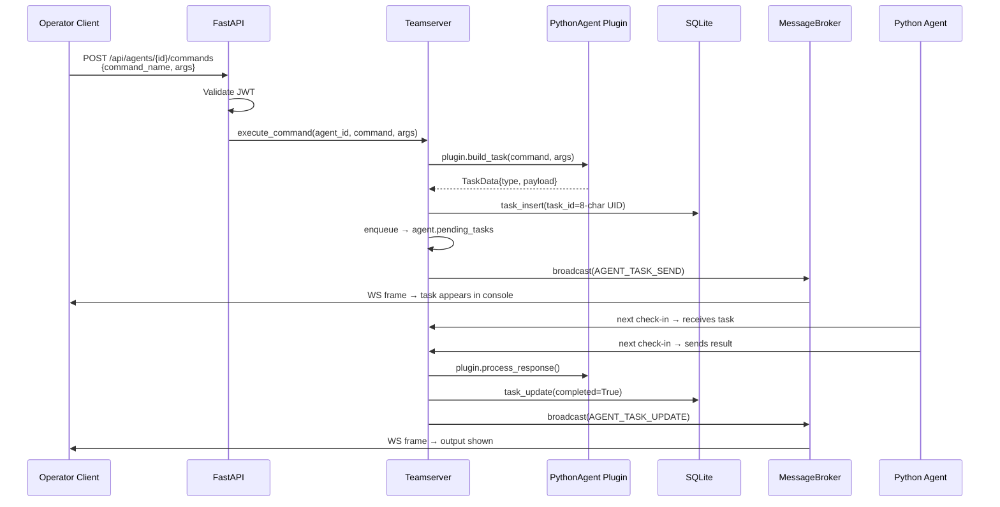
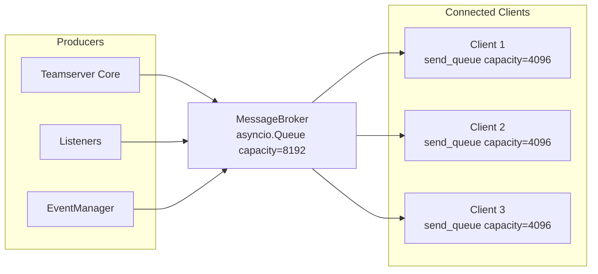

# ExecuteC2 — Architecture

## Overview

ExecuteC2 is a multiplayer command-and-control teamserver for authorized red team operations. The server is a Python asyncio application built on FastAPI, exposing a TLS-encrypted HTTPS REST API and WebSocket channel. Multiple operator clients connect simultaneously via web browser or CLI. Agents (Python-based, cross-platform) beacon home through extensible listener plugins.

## Technology Stack

| Component | Technology | Version |
|---|---|---|
| Runtime | Python (asyncio) | >= 3.12 |
| HTTP framework | FastAPI | >= 0.115 |
| ASGI server | uvicorn | >= 0.34 |
| Database | SQLite (WAL mode) via aiosqlite | >= 0.20 |
| Auth | JWT (HMAC-SHA256) via PyJWT | >= 2.9 |
| Data validation | Pydantic | >= 2.10 |
| Serialization | msgpack | >= 1.1 |
| Cryptography | cryptography (AES-GCM, ChaCha20-Poly1305) | >= 44.0 |
| Logging | structlog (JSON output) | >= 24.4 |
| Testing | pytest + pytest-asyncio + httpx | >= 8.3 / 0.24 / 0.28 |

## Repository Layout

```text
executec2/
├── pyproject.toml
├── src/executec2/
│   ├── __init__.py
│   ├── __main__.py              # CLI entry point
│   ├── server/
│   │   ├── __init__.py
│   │   ├── app.py               # FastAPI application factory
│   │   ├── auth.py              # JWT + operator management
│   │   ├── database.py          # aiosqlite layer + schema
│   │   ├── broker.py            # WebSocket message broker
│   │   ├── events.py            # Event manager (pre/post hooks)
│   │   ├── models.py            # Pydantic models
│   │   └── routes/              # FastAPI route modules
│   │       ├── __init__.py
│   │       ├── agents.py
│   │       ├── listeners.py
│   │       ├── tasks.py
│   │       ├── tunnels.py
│   │       ├── credentials.py
│   │       ├── targets.py
│   │       └── sync.py
│   ├── listeners/               # Listener plugin implementations
│   │   ├── __init__.py
│   │   ├── base.py              # Listener ABC
│   │   └── http_listener.py     # HTTP/S listener
│   ├── agents/                  # Agent plugin definitions
│   │   ├── __init__.py
│   │   ├── base.py              # Agent plugin ABC
│   │   └── python_agent.py      # Python agent plugin
│   ├── commands/                # Command registry + built-ins
│   │   ├── __init__.py
│   │   ├── registry.py
│   │   └── builtin/
│   │       └── __init__.py
│   ├── tunnels/                 # SOCKS/portfwd implementation
│   │   ├── __init__.py
│   │   └── socks5.py
│   └── config/                  # Configuration schemas
│       ├── __init__.py
│       └── schema.py
├── agent/                       # Standalone Python agent payload
│   ├── __init__.py
│   ├── main.py                  # Agent entry point
│   ├── connector_http.py        # HTTP/S transport
│   ├── crypto.py                # AES-GCM encryption
│   └── commands/                # Agent-side command handlers
│       └── __init__.py
├── tests/
│   ├── unit/
│   │   └── __init__.py
│   ├── integration/
│   │   └── __init__.py
│   └── conftest.py
└── docker/
    ├── Dockerfile
    └── docker-compose.yml
```

## Component Diagram



## Key Components

| Component | Module | Role |
|---|---|---|
| **Teamserver** | `server/app.py` | Central coordinator; owns all managers, FastAPI lifespan |
| **FastAPI App** | `server/app.py` | HTTPS REST API + WebSocket server |
| **Auth** | `server/auth.py` | JWT token issue/verify, operator credential management |
| **Database** | `server/database.py` | aiosqlite CRUD layer, schema migration, WAL mode |
| **MessageBroker** | `server/broker.py` | asyncio fan-out event bus to connected operator WebSockets |
| **EventManager** | `server/events.py` | Pre/post hook dispatch with cancellation support |
| **TaskManager** | `server/routes/tasks.py` | Task routing by type (task, job, tunnel) |
| **TunnelManager** | `tunnels/socks5.py` | SOCKS5 proxy + local port-forward lifecycle |
| **PluginLoader** | `listeners/__init__.py`, `agents/__init__.py` | Python module loading via importlib |
| **HTTPListener** | `listeners/http_listener.py` | HTTP/S listener accepting agent check-ins |
| **PythonAgent Plugin** | `agents/python_agent.py` | Server-side agent type definition, command parsing, build |
| **CommandRegistry** | `commands/registry.py` | Command dispatch table, built-in command registration |
| **Python Agent** | `agent/main.py` | Standalone agent payload (HTTP polling, AES-GCM encryption) |

## Data Flow: Agent Check-in



## Data Flow: Operator Command



## Startup Sequence

```python
async def main():
    config = load_config("config.yaml")
    config.validate()

    # 1. Initialize JWT with ephemeral HMAC keys
    jwt_manager = JWTManager(
        access_ttl=config.server.access_token_ttl,
        refresh_ttl=config.server.refresh_token_ttl,
    )

    # 2. Initialize database (WAL mode)
    db = await Database.create(config.server.data_dir / "executec2.db")
    await db.migrate()

    # 3. Initialize event manager
    event_manager = EventManager(worker_count=4, queue_size=256)

    # 4. Initialize message broker
    broker = MessageBroker(broadcast_capacity=8192)

    # 5. Load plugins (listeners + agent types)
    plugin_loader = PluginLoader(config.plugins)
    await plugin_loader.load_all()

    # 6. Restore state from database (agents, listeners)
    await restore_state(db, plugin_loader)

    # 7. Start agent tick updater (800ms interval)
    asyncio.create_task(agent_tick_updater(broker, interval=0.8))

    # 8. Create and start FastAPI app
    app = create_app(config, db, jwt_manager, broker, event_manager, plugin_loader)
    server = uvicorn.Server(uvicorn.Config(
        app, host=config.server.host, port=config.server.port,
        ssl_certfile=config.server.tls_cert,
        ssl_keyfile=config.server.tls_key,
    ))
    await server.serve()
```

## Async Architecture

ExecuteC2 is **fully async**. Every I/O operation uses `await`:

- **Database:** All queries via `aiosqlite` (async context managers)
- **HTTP:** FastAPI async route handlers, httpx for outbound requests
- **WebSocket:** FastAPI WebSocket with async send/receive
- **Listeners:** `asyncio.start_server()` for HTTP listener sockets
- **Tunnels:** `asyncio.open_connection()` / `asyncio.start_server()` for SOCKS5 and port forwarding
- **Events:** Pre-hooks run with `asyncio.wait_for(timeout=5.0)`, post-hooks dispatched to an `asyncio.TaskGroup` worker pool
- **Tick updater:** `asyncio.sleep(0.8)` loop broadcasting agent heartbeats

No blocking I/O is permitted in the main event loop. CPU-bound operations (encryption, compression) use `asyncio.to_thread()` if they exceed ~1ms.

## Security

### TLS

The teamserver API requires TLS. uvicorn is configured with `ssl_certfile` and `ssl_keyfile`. Minimum TLS version is 1.2.

### Authentication

- Operators authenticate via `POST /api/auth/login` with username + password
- Passwords are compared as `SHA256(plaintext)` against stored hashes
- JWT access tokens (HMAC-SHA256) are short-lived (configurable, default 24h)
- JWT refresh tokens are longer-lived (configurable, default 7 days)
- HMAC signing keys are **ephemeral** — regenerated on each server startup, invalidating all prior sessions
- Rate limiting on auth endpoints (configurable, default 10 req/min per IP)

### Traffic Blending

HTTP listeners support configurable malleable C2 profiles:
- Configurable URIs, HTTP methods, User-Agent whitelists, Host header whitelists
- Custom request/response headers
- HTML response templates with payload embedding (`<<<PAYLOAD_DATA>>>` marker)
- Non-matching requests receive a configurable decoy page

### Encryption Key Management

- Each listener instance has its own AES-256 key (32 bytes), generated at listener creation
- Keys are never reused across listeners
- Agent-to-server encryption: AES-256-GCM with random 12-byte nonce per message
- Key derivation: HKDF-SHA256 from the listener's master key, with per-agent salt derived from agent ID

### Operator Audit Trail

All operator actions are logged via structlog with JSON output:

```python
structlog.get_logger().info(
    "operator.command",
    operator=username,
    agent_id=agent_id,
    command=command_name,
    timestamp=datetime.utcnow().isoformat(),
)
```

Every state change, agent check-in, and operator action includes:
- Operator username (for operator-initiated actions)
- Agent ID (for agent-related events)
- Timestamp (ISO 8601)
- Event type and relevant context

Log levels:
- `DEBUG` — Protocol detail (encrypted payloads, WebSocket frames)
- `INFO` — Operations (agent check-in, command dispatch, listener start/stop)
- `WARNING` — Anomalies (auth failures, invalid check-ins, backpressure triggers)
- `ERROR` — Failures (database errors, plugin load failures, unhandled exceptions)

### Credential Storage

Credentials stored in the SQLite `credentials` table are encrypted at rest using AES-256-GCM with a key derived from the server's master secret via HKDF-SHA256.

### Agent Anti-Analysis

Explicitly out of scope for v1.0. The Python agent ships as a raw `.py` script or PyInstaller-compiled binary without obfuscation. Future versions may add:
- String encryption
- Control flow obfuscation
- Anti-debugging checks
- Polymorphic stagers

## MessageBroker Design

The MessageBroker manages fan-out delivery of events to all connected operator WebSockets.



### Message Types

| Type | Behavior | Use Case |
|---|---|---|
| **Event** (`msg_type=0`) | Append-only, ordered delivery | Task updates, new agents, chat messages |
| **State** (`msg_type=1`) | Last-write-wins per `state_key` | Agent tick heartbeats (only latest tick delivered) |

### Backpressure

Per-client `send_queue` (asyncio.Queue, capacity 4096):
- 75% full → `WARNING` log
- 95% full → drop message, log dropped count
- Queue full → close WebSocket connection

### Subscription Categories

Clients subscribe to event categories via `POST /api/sync/subscribe`. Only subscribed categories are delivered. On subscribe, the server sends a presync batch (up to 500 packets per category) of historical data.

| Category | Presync Content | Realtime Events |
|---|---|---|
| `listeners` | Active listeners | Listener start/stop/edit |
| `agents` | All agents | Agent new/update/remove/tick |
| `tasks` | Completed tasks from DB | Task send/update/remove |
| `console` | Console output history | Console output/clear |
| `chat` | Chat history | New messages |
| `downloads` | Download records | Download create/update/complete |
| `credentials` | All credentials | Credential create/update/delete |
| `targets` | All targets | Target create/update/delete |
| `tunnels` | Active tunnels | Tunnel create/update/delete |

## Agent Payload Strategy

v1.0 ships with a **raw Python agent** — a standalone Python script that requires a Python interpreter on the target host.

| Strategy | Size | Requirement | OPSEC | v1 Status |
|---|---|---|---|---|
| Raw Python script | ~50 KB | Python on target | Low — plaintext source | **Shipped** |
| PyInstaller binary | ~20 MB | None (standalone) | Medium — decompilable | Future |
| Nuitka compiled | ~10 MB | None (standalone) | Higher — native code | Future |
| Stager + download | ~2 KB stager | Python on target | Low — two-stage | Future |

The agent payload is a self-contained Python package in `agent/` that can be copied to the target and executed with `python -m agent` or bundled via PyInstaller.

## Plugin System

Plugins are Python modules loaded via `importlib.import_module()`. Two plugin ABCs exist:

- **ListenerPlugin** (`listeners/base.py`) — Defines how agents connect to the teamserver
- **AgentPlugin** (`agents/base.py`) — Defines agent type, command parsing, task serialization, response processing

Plugins are discovered from configured paths at startup. Each plugin module must expose a class that inherits from the appropriate ABC and is decorated with `@register_plugin`.

See [05_AGENT_SPEC.md](05_AGENT_SPEC.md) for full ABC definitions.

## Event System

The EventManager provides pre/post hooks for all state transitions:

- **Pre-hooks:** Synchronous, 5-second timeout, can cancel the operation by returning `False`
- **Post-hooks:** Asynchronous (worker pool of 4 asyncio tasks), 30-second timeout, non-cancellable
- **Priority ordering:** Lower number = higher priority

Event types:

```
agent.new, agent.checkin, agent.update, agent.terminate, agent.remove
listener.start, listener.stop
task.create, task.complete
credential.add, credential.edit, credential.remove
target.add, target.edit, target.remove
tunnel.start, tunnel.stop
download.start, download.complete
client.connect, client.disconnect
```

See [05_AGENT_SPEC.md](05_AGENT_SPEC.md) for hook registration details.
