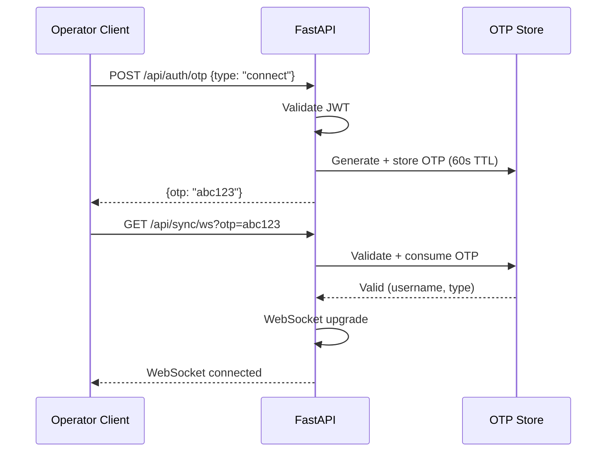

# ExecuteC2 — API Reference

All endpoints served over HTTPS on the configured `server.port`. JWT passed as `Authorization: Bearer <access_token>` unless noted. All request/response bodies are JSON. Models reference [02_DATA_MODELS.md](02_DATA_MODELS.md).

## Authentication

### POST /api/auth/login

- **Auth:** None
- **Request:** `{"username": "str", "password": "str"}`
- **Response:** `{"access_token": "str", "refresh_token": "str"}`
- **Errors:** `401` invalid credentials, `429` rate limited
- **Notes:** Password compared as `SHA256(plaintext)` vs stored hash. Rate limited: 10 req/min per IP.

### POST /api/auth/refresh

- **Auth:** Bearer refresh token
- **Response:** `{"access_token": "str", "refresh_token": "str"}`
- **Errors:** `401` invalid/expired refresh token

### POST /api/auth/otp

- **Auth:** JWT
- **Request:** `{"type": "connect" | "tunnel"}`
- **Response:** `{"otp": "str"}`
- **Notes:** OTP is single-use, expires after 60 seconds.

## WebSocket

### GET /api/sync/ws?otp={otp}

- **Auth:** OTP (`connect` type)
- **Protocol:** WebSocket upgrade
- **Purpose:** Primary operator sync channel; server sends binary sync packets (see [02_DATA_MODELS.md#websocket-sync-packet-types](02_DATA_MODELS.md#websocket-sync-packet-types))
- **Sync sequence:**
  1. Server sends `SYNC_START (0x11)`
  2. Server sends `SYNC_CATEGORY_BATCH (0x15)` for default categories (listeners, agents) — up to 500 packets per batch
  3. Server sends `SYNC_FINISH (0x12)`
  4. Client is marked synced; realtime events begin flowing
- **Client → Server:** Not used (control via REST API)

### GET /api/sync/channel?otp={otp}

- **Auth:** OTP (`tunnel` type)
- **Protocol:** WebSocket upgrade
- **Purpose:** Data channel for tunnel traffic (SOCKS5, port forwarding)

### POST /api/sync/subscribe

- **Auth:** JWT
- **Request:** `{"categories": ["tasks", "console", "chat", "downloads", "credentials", "targets", "tunnels"]}`
- **Response:** `204 No Content`
- **Side effect:** Server sends `SYNC_CATEGORY_BATCH` presync for each newly subscribed category over the operator's WebSocket connection.

## Listeners

### GET /api/listeners

- **Auth:** JWT
- **Response:** `[ListenerData, ...]` — Array of all listeners (active + stopped)

### POST /api/listeners

- **Auth:** JWT
- **Request:**
  ```json
  {
    "listener_name": "str",
    "listener_type": "str",
    "config": { ... }
  }
  ```
- **Response:** `201` with created `ListenerData`
- **Errors:** `409` name already exists, `400` invalid config
- **Side effect:** Broadcasts `LISTENER_START` via WebSocket.

### PUT /api/listeners/{listener_name}

- **Auth:** JWT
- **Request:** `{"config": { ... }}` — Partial config update
- **Response:** Updated `ListenerData`
- **Errors:** `404` not found
- **Side effect:** Broadcasts `LISTENER_EDIT`.

### POST /api/listeners/{listener_name}/stop

- **Auth:** JWT
- **Response:** `204 No Content`
- **Errors:** `404` not found, `409` already stopped
- **Side effect:** Broadcasts `LISTENER_STOP`.

### POST /api/listeners/{listener_name}/pause

- **Auth:** JWT
- **Response:** `204 No Content`
- **Notes:** Paused listeners accept connections but do not dequeue tasks.

### POST /api/listeners/{listener_name}/resume

- **Auth:** JWT
- **Response:** `204 No Content`

## Agents

### GET /api/agents

- **Auth:** JWT
- **Response:** `[AgentData, ...]` — Array of all agents

### DELETE /api/agents/{agent_id}

- **Auth:** JWT
- **Response:** `204 No Content`
- **Errors:** `404` not found
- **Side effect:** Broadcasts `AGENT_REMOVE`.

### POST /api/agents/{agent_id}/commands

- **Auth:** JWT
- **Request:**
  ```json
  {
    "command_name": "str",
    "args": { ... }
  }
  ```
- **Response:** `201` with `TaskData` (task_id, command_line, start_date)
- **Errors:** `404` agent not found, `400` unknown command, `422` invalid args
- **Side effect:** Task enqueued in agent's pending queue. Broadcasts `AGENT_TASK_SEND`.

### POST /api/agents/{agent_id}/commands/raw

- **Auth:** JWT
- **Request:** `{"data": "base64-encoded bytes"}`
- **Response:** `201` with `TaskData`
- **Notes:** Send raw task bytes directly to agent queue. For advanced use.

### PUT /api/agents/{agent_id}/tag

- **Auth:** JWT
- **Request:** `{"tag": "str"}`
- **Response:** `204 No Content`
- **Side effect:** Broadcasts `AGENT_UPDATE`.

### PUT /api/agents/{agent_id}/mark

- **Auth:** JWT
- **Request:** `{"mark": "" | "inactive" | "disconnect" | "terminated"}`
- **Response:** `204 No Content`
- **Side effect:** Broadcasts `AGENT_UPDATE`.

### PUT /api/agents/{agent_id}/color

- **Auth:** JWT
- **Request:** `{"color": "#rrggbb"}`
- **Response:** `204 No Content`
- **Side effect:** Broadcasts `AGENT_UPDATE`.

## Tasks

### GET /api/agents/{agent_id}/tasks

- **Auth:** JWT
- **Response:** `[TaskData, ...]` — All tasks for this agent

### POST /api/agents/{agent_id}/tasks/{task_id}/cancel

- **Auth:** JWT
- **Response:** `204 No Content`
- **Errors:** `404` agent or task not found, `409` already completed
- **Side effect:** Broadcasts `AGENT_TASK_REMOVE`.

### DELETE /api/agents/{agent_id}/tasks/{task_id}

- **Auth:** JWT
- **Response:** `204 No Content`
- **Side effect:** Broadcasts `AGENT_TASK_REMOVE`.

## Downloads

### GET /api/downloads

- **Auth:** JWT
- **Response:** `[DownloadData, ...]`

### GET /api/downloads/{file_id}

- **Auth:** JWT
- **Response:** Raw file bytes with `Content-Disposition: attachment`
- **Errors:** `404` not found, `409` download not complete

### DELETE /api/downloads/{file_id}

- **Auth:** JWT
- **Response:** `204 No Content`
- **Side effect:** Broadcasts `DOWNLOAD_DELETE`.

## Credentials

### GET /api/credentials

- **Auth:** JWT
- **Response:** `[CredentialData, ...]`
- **Notes:** `secret` field is decrypted from at-rest encryption before response.

### POST /api/credentials

- **Auth:** JWT
- **Request:**
  ```json
  {
    "username": "str",
    "secret": "str",
    "realm": "str",
    "cred_type": "password | hash_ntlm | hash_sha256 | ticket | key | token | other",
    "host": "str",
    "source": "str"
  }
  ```
- **Response:** `201` with created `CredentialData`
- **Side effect:** Broadcasts `CREDS_CREATE`.

### PUT /api/credentials/{cred_id}

- **Auth:** JWT
- **Request:** Partial `CredentialData` fields
- **Response:** Updated `CredentialData`
- **Side effect:** Broadcasts `CREDS_UPDATE`.

### DELETE /api/credentials/{cred_id}

- **Auth:** JWT
- **Response:** `204 No Content`
- **Side effect:** Broadcasts `CREDS_DELETE`.

### PUT /api/credentials/{cred_id}/tag

- **Auth:** JWT
- **Request:** `{"tag": "str"}`
- **Response:** `204 No Content`
- **Side effect:** Broadcasts `CREDS_UPDATE`.

## Targets

### GET /api/targets

- **Auth:** JWT
- **Response:** `[TargetData, ...]`

### POST /api/targets

- **Auth:** JWT
- **Request:**
  ```json
  {
    "computer": "str",
    "domain": "str",
    "address": "str",
    "os": "str",
    "os_desc": "str",
    "info": "str"
  }
  ```
- **Response:** `201` with created `TargetData`
- **Side effect:** Broadcasts `TARGETS_CREATE`.

### PUT /api/targets/{target_id}

- **Auth:** JWT
- **Request:** Partial `TargetData` fields
- **Response:** Updated `TargetData`
- **Side effect:** Broadcasts `TARGETS_UPDATE`.

### DELETE /api/targets/{target_id}

- **Auth:** JWT
- **Response:** `204 No Content`
- **Side effect:** Broadcasts `TARGETS_DELETE`.

### PUT /api/targets/{target_id}/tag

- **Auth:** JWT
- **Request:** `{"tag": "str"}`
- **Response:** `204 No Content`
- **Side effect:** Broadcasts `TARGETS_UPDATE`.

## Tunnels

### GET /api/tunnels

- **Auth:** JWT
- **Response:** `[TunnelData, ...]`

### POST /api/tunnels/socks5

- **Auth:** JWT
- **Request:**
  ```json
  {
    "agent_id": "str",
    "info": "str",
    "lhost": "127.0.0.1",
    "lport": 1080,
    "use_auth": false,
    "username": "str",
    "password": "str"
  }
  ```
- **Response:** `201` with created `TunnelData`
- **Side effect:** Broadcasts `TUNNEL_CREATE`. Opens local SOCKS5 listener.

### POST /api/tunnels/lportfwd

- **Auth:** JWT
- **Request:**
  ```json
  {
    "agent_id": "str",
    "info": "str",
    "lhost": "127.0.0.1",
    "lport": 4444,
    "thost": "10.0.0.1",
    "tport": 80
  }
  ```
- **Response:** `201` with created `TunnelData`
- **Side effect:** Broadcasts `TUNNEL_CREATE`. Opens local port listener.

### POST /api/tunnels/{tunnel_id}/stop

- **Auth:** JWT
- **Response:** `204 No Content`
- **Side effect:** Broadcasts `TUNNEL_DELETE`. Closes local listener and all tunnel connections.

### PUT /api/tunnels/{tunnel_id}/info

- **Auth:** JWT
- **Request:** `{"info": "str"}`
- **Response:** `204 No Content`
- **Side effect:** Broadcasts `TUNNEL_UPDATE`.

## Chat

### POST /api/chat

- **Auth:** JWT
- **Request:** `{"message": "str"}`
- **Response:** `201` with `ChatMessage`
- **Side effect:** Broadcasts `CHAT_MESSAGE`.

## Error Response Format

All error responses use a consistent JSON structure:

```json
{
  "detail": "Human-readable error message",
  "code": "MACHINE_READABLE_CODE"
}
```

Common error codes:

| HTTP Status | Code | Description |
|---|---|---|
| 400 | `BAD_REQUEST` | Malformed request body |
| 401 | `UNAUTHORIZED` | Missing/invalid/expired JWT |
| 403 | `FORBIDDEN` | Insufficient permissions |
| 404 | `NOT_FOUND` | Resource does not exist |
| 409 | `CONFLICT` | Resource state conflict (duplicate name, already stopped) |
| 422 | `VALIDATION_ERROR` | Pydantic validation failure |
| 429 | `RATE_LIMITED` | Too many requests |
| 500 | `INTERNAL_ERROR` | Unhandled server error |

## OTP System

OTPs protect WebSocket upgrades. Flow:



OTPs are:
- Single-use (consumed on first use)
- Time-limited (60 seconds)
- Type-checked (a `connect` OTP cannot open a `tunnel` channel)
- Stored in-memory (dict), not persisted to database
