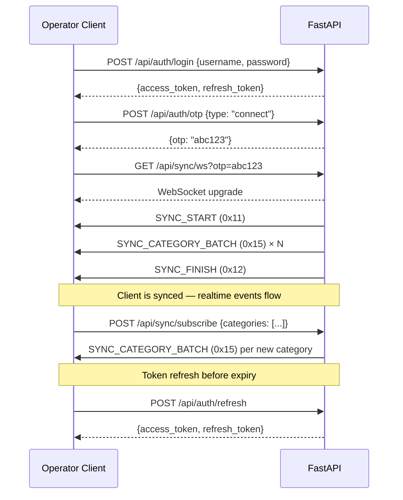
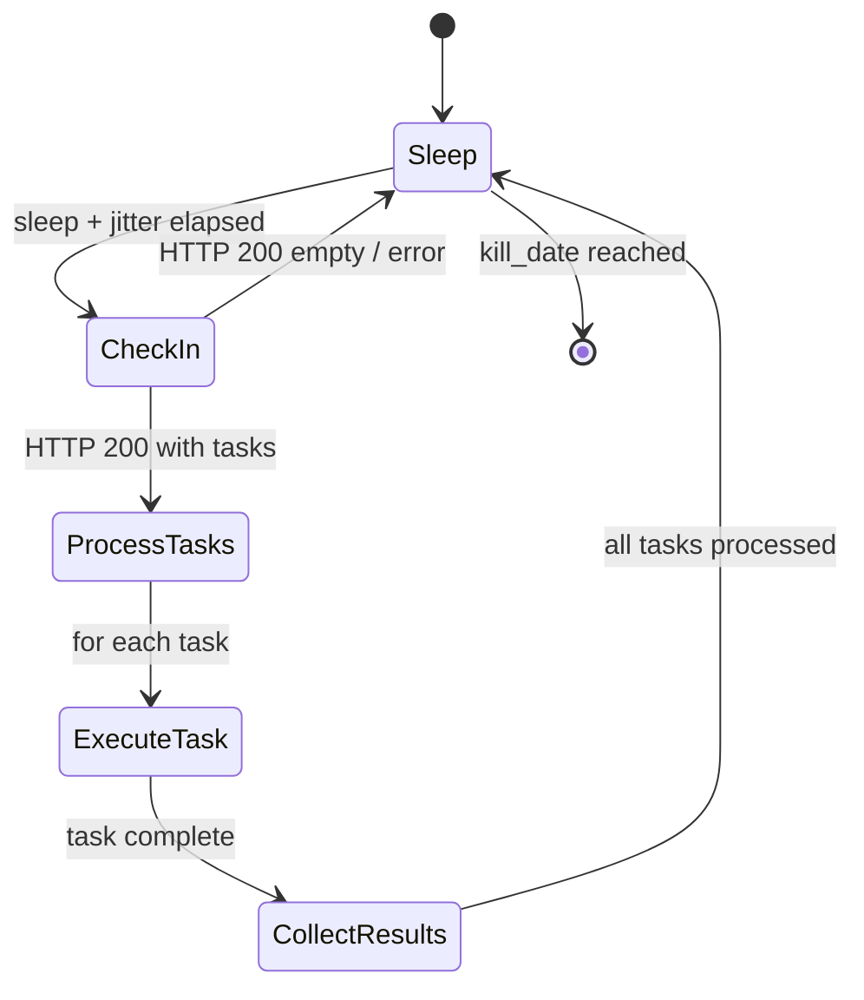
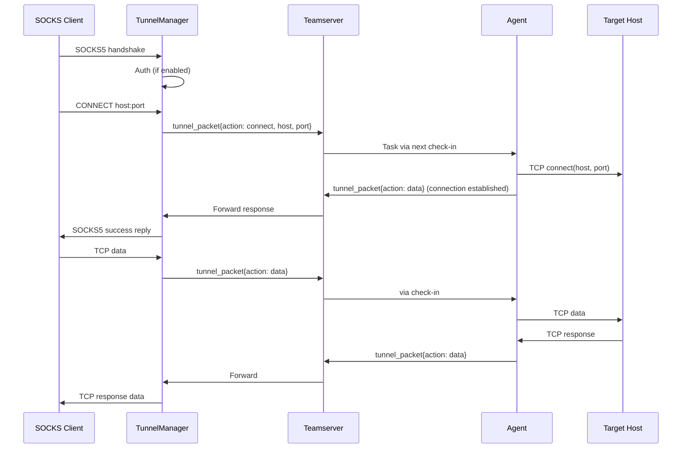

# ExecuteC2 — Protocol Spec

## Operator–Teamserver Protocol

### Transport

- **Protocol:** HTTPS (TLS 1.2+)
- **HTTP Framework:** FastAPI (uvicorn ASGI)
- **WebSocket:** FastAPI WebSocket (built on Starlette)
- **Auth:** JWT Bearer tokens (HMAC-SHA256, ephemeral keys per server session)

### Connection Sequence



### WebSocket Frame Format

Binary frames. Layout:

```
[1 byte: SyncPacketType] [N bytes: msgpack-encoded payload]
```

- **Event messages** (`BrokerMsgType.EVENT = 0`): Append-only, all delivered in order
- **State messages** (`BrokerMsgType.STATE = 1`): Last-write-wins per `state_key` — only most recent value delivered (used for agent tick heartbeats)

See [02_DATA_MODELS.md#websocket-sync-packet-types](02_DATA_MODELS.md#websocket-sync-packet-types) for packet type enum.

### Subscription Categories

See [01_ARCHITECTURE.md#subscription-categories](01_ARCHITECTURE.md#subscription-categories) for the full category table.

## Agent–Listener Protocol (HTTP/S)

v1.0 supports HTTP/S as the sole agent-to-listener transport.

### Encryption Scheme

**Algorithm:** AES-256-GCM (authenticated encryption)

**Key hierarchy:**

```
listener_master_key (32 bytes, hex-encoded in config)
    │
    ├── HKDF-SHA256(master_key, salt=agent_id_bytes, info=b"agent-session")
    │   └── agent_session_key (32 bytes) — per-agent symmetric key
    │
    └── HKDF-SHA256(master_key, salt=b"beat", info=b"beat-encryption")
        └── beat_key (32 bytes) — used for initial registration beat
```

**Wire format for encrypted payloads:**

```
[12 bytes: nonce] [N bytes: AES-GCM ciphertext] [16 bytes: GCM auth tag]
```

Total overhead: 28 bytes per message.

```python
from cryptography.hazmat.primitives.ciphers.aead import AESGCM
import os

def encrypt(key: bytes, plaintext: bytes) -> bytes:
    nonce = os.urandom(12)
    aesgcm = AESGCM(key)
    ciphertext = aesgcm.encrypt(nonce, plaintext, None)
    return nonce + ciphertext  # ciphertext includes 16-byte tag

def decrypt(key: bytes, data: bytes) -> bytes:
    nonce = data[:12]
    ciphertext = data[12:]
    aesgcm = AESGCM(key)
    return aesgcm.decrypt(nonce, ciphertext, None)
```

### Check-in Protocol (Agent → Listener)

```
HTTP POST <configured_uri>
Headers:
    User-Agent: <one of configured user_agents>
    Host: <one of configured host_headers>
    <beat_header>: base64( AES-GCM-encrypt(
        agent_type    [4 bytes: UTF-8 type name length-prefixed]
      + agent_id      [8 bytes: hex agent ID as ASCII]
      + beat_data     [variable: msgpack registration/heartbeat]
    , key=beat_key) )
    [additional configured request_headers]
Body: AES-GCM-encrypt(
    msgpack([task_response_1, task_response_2, ...])
, key=agent_session_key)
```

### Beat Data Format

The beat header payload (after decryption) contains:

```python
# First check-in (registration beat):
beat = {
    "type": "register",
    "hostname": "WORKSTATION01",
    "username": "admin",
    "domain": "CORP",
    "internal_ip": "10.0.0.50",
    "os": 1,              # OSType enum
    "os_desc": "Windows 10 22H2",
    "arch": "x64",
    "pid": 1234,
    "process": "python.exe",
    "elevated": False,
    "sleep": 60,
    "jitter": 20,
}

# Subsequent check-ins (heartbeat):
beat = {
    "type": "heartbeat",
}
```

Encoded as msgpack inside the encrypted beat header.

### Server Validation

The HTTP listener validates incoming requests in order:

1. **URI** — Must match one of the configured `uri` paths
2. **Host header** — Must match `host_header` whitelist (if configured)
3. **User-Agent** — Must match `user_agent` whitelist (if configured)
4. **Beat header** — Must be present, base64-decodable, AES-GCM-decryptable
5. **Agent type** — Must match a registered agent plugin watermark
6. **Agent ID** — If new, create agent via `agent_checkin()`; if known, update tick

Requests failing any check receive the configured `page_error` HTML response (decoy page).

### Response Protocol (Listener → Agent)

```
HTTP 200 OK
Content-Type: text/html
[configured response_headers]

Body: <page_payload template>
    with <<<PAYLOAD_DATA>>> replaced by:
    base64( AES-GCM-encrypt(
        msgpack([task_1, task_2, ...])
    , key=agent_session_key) )
```

The `page_payload` template is an HTML page. The agent extracts payload data by:
1. Finding the `<<<PAYLOAD_DATA>>>` marker position (known at compile/config time as `payload_offset` and `payload_size`)
2. Base64-decoding the extracted string
3. AES-GCM-decrypting with its session key
4. msgpack-decoding the task list

If no tasks are pending, the payload marker is replaced with an empty base64 string (encrypts to a valid but empty msgpack array).

### Task Serialization

Tasks sent to agent (inside encrypted payload):

```python
# Single task in the task list:
task = {
    "id": "a1b2c3d4",       # task_id
    "type": 0,               # TaskType enum
    "cmd": 4,                # Command ID (see 05_AGENT_SPEC.md)
    "args": { ... },         # Command-specific arguments (msgpack)
}
```

### Task Response Serialization

Task responses from agent (in HTTP body):

```python
# Single response in the response list:
response = {
    "id": "a1b2c3d4",       # task_id
    "status": 1,             # 0=in_progress, 1=complete, 2=error
    "output": b"...",        # Command output bytes
    "error": "",             # Error message if status=2
}
```

### Agent Polling Loop



The agent's polling interval is `sleep ± (sleep × jitter / 100)` seconds, with jitter applied as a random offset each cycle.

### Error Handling

| Scenario | Agent Behavior |
|---|---|
| HTTP non-200 | Retry with exponential backoff (2x, max 5 min) |
| Connection refused | Retry with exponential backoff |
| Decryption failure | Log error, skip response, retry next cycle |
| Invalid task format | Skip task, report error in next check-in |
| Kill date reached | Agent self-terminates (exits process) |

## Tunnel Data Protocol

Tunnel traffic (SOCKS5, port forwarding) flows through a dedicated WebSocket channel between operator client and teamserver, and through the agent's check-in cycle.

### Tunnel Packet Format

```python
tunnel_packet = {
    "tunnel_id": "str",
    "channel_id": int,       # Per-connection ID within the tunnel
    "action": "data" | "connect" | "close" | "error",
    "data": b"...",          # Raw TCP payload (for "data" action)
    "host": "str",           # Target host (for "connect" action, SOCKS5)
    "port": int,             # Target port (for "connect" action)
    "error_code": 0,         # SOCKS5 error code (for "error" action)
}
```

### SOCKS5 Flow



Tunnel data is queued in the agent's `pending_tunnel_data` queue and delivered alongside regular tasks during check-in. Latency is bounded by the agent's sleep interval.
