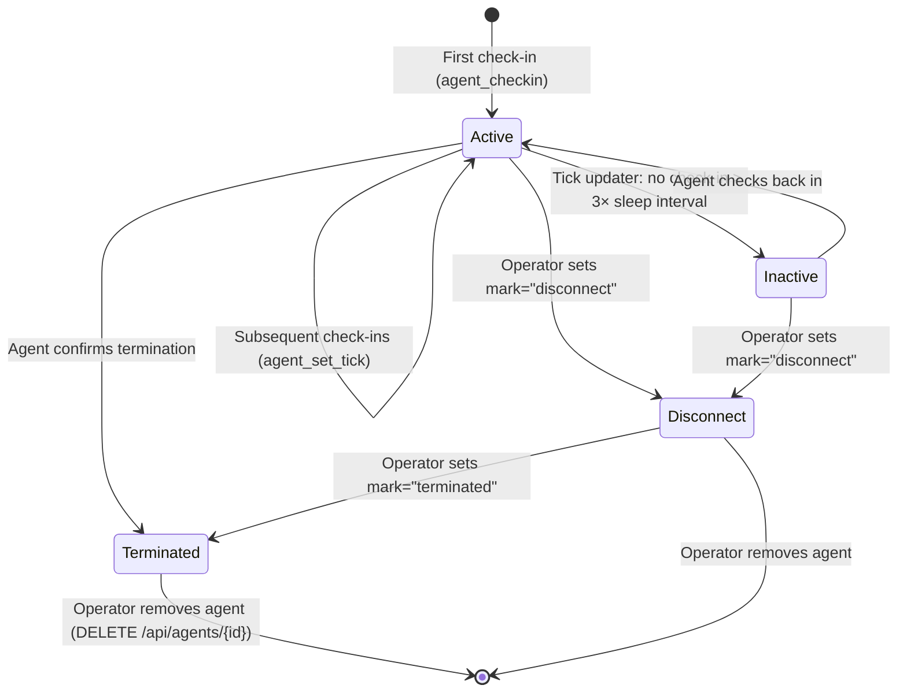
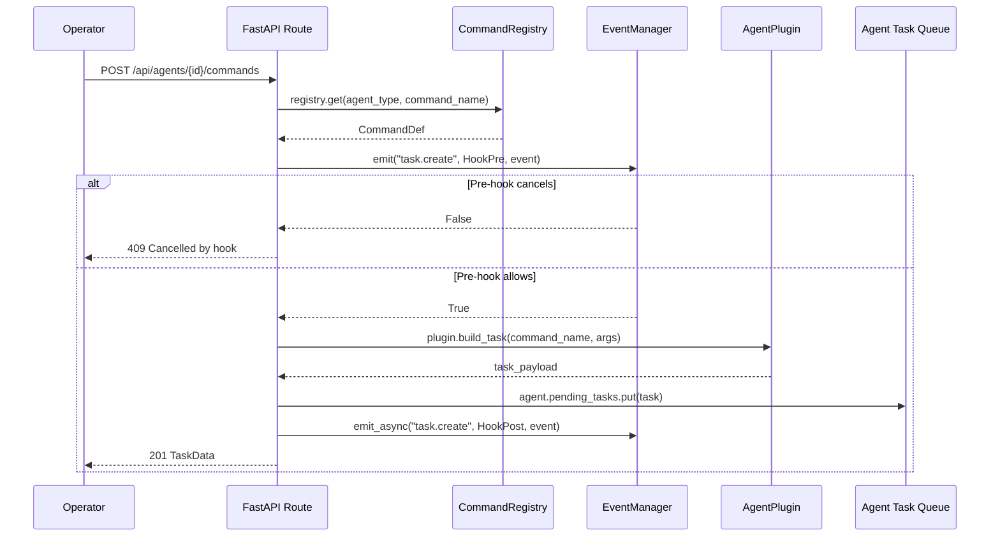

# ExecuteC2 — Agent & Plugin Spec

## Plugin System Overview

ExecuteC2 uses Python modules loaded via `importlib` for all extensibility. Two plugin types exist for v1.0:

| Type | ABC | Registration | Module |
|---|---|---|---|
| `listener` | `ListenerPlugin` | `PluginLoader.register_listener()` | `listeners/base.py` |
| `agent` | `AgentPlugin` | `PluginLoader.register_agent()` | `agents/base.py` |

Plugins are discovered from paths listed in the server configuration. Each plugin module must contain a class inheriting from the appropriate ABC.

## Plugin ABCs

### ListenerPlugin (`src/executec2/listeners/base.py`)

```python
from abc import ABC, abstractmethod
from typing import Any


class ListenerPlugin(ABC):
    """Base class for all listener plugins."""

    @abstractmethod
    async def start(self, config: dict, teamserver: "TeamserverInterface") -> None:
        """Start the listener with the given configuration.

        Args:
            config: Listener-specific config dict (validated by the plugin).
            teamserver: Interface for callbacks into the teamserver.
        """
        ...

    @abstractmethod
    async def stop(self) -> None:
        """Stop the listener and release all resources."""
        ...

    @abstractmethod
    async def pause(self) -> None:
        """Pause the listener (accept connections but don't dequeue tasks)."""
        ...

    @abstractmethod
    async def resume(self) -> None:
        """Resume a paused listener."""
        ...

    @abstractmethod
    def validate_config(self, config: dict) -> dict:
        """Validate and normalize listener config. Raises ValueError on invalid."""
        ...

    @abstractmethod
    def get_info(self) -> dict:
        """Return listener metadata (name, type, protocol, etc.)."""
        ...
```

### AgentPlugin (`src/executec2/agents/base.py`)

```python
from abc import ABC, abstractmethod
from typing import Any


class AgentPlugin(ABC):
    """Base class for all agent type plugins."""

    @abstractmethod
    def get_info(self) -> dict:
        """Return agent type metadata.

        Returns:
            dict with keys: name, watermark, compatible_listeners
        """
        ...

    @abstractmethod
    def parse_beat(self, beat_data: bytes) -> dict:
        """Parse a registration beat from an agent.

        Args:
            beat_data: Decrypted msgpack beat payload.

        Returns:
            Dict of agent fields to populate AgentData.
        """
        ...

    @abstractmethod
    def build_task(self, command_name: str, args: dict) -> dict:
        """Build a task payload for the agent.

        Args:
            command_name: Name of the command to execute.
            args: Command arguments dict.

        Returns:
            Dict with keys: type (TaskType), cmd (int command ID), args (dict).
        """
        ...

    @abstractmethod
    def process_response(self, task_id: str, response: dict) -> dict:
        """Process a task response from the agent.

        Args:
            task_id: The task ID this response belongs to.
            response: Decoded response dict from agent.

        Returns:
            Dict with keys: message_type (MessageType), message (str),
                clear_text (str), completed (bool).
        """
        ...

    @abstractmethod
    def get_commands(self) -> list[dict]:
        """Return the command definitions this agent type supports.

        Returns:
            List of command definition dicts (see Command Definition Format).
        """
        ...
```

### TeamserverInterface (exposed to plugins)

```python
from typing import Protocol


class TeamserverInterface(Protocol):
    """Interface plugins use to interact with the teamserver."""

    # Agent lifecycle
    async def agent_checkin(
        self, agent_id: str, agent_type: str, beat_data: dict,
        external_ip: str, listener_name: str,
    ) -> None: ...

    async def agent_set_tick(self, agent_id: str) -> None: ...

    async def agent_process_responses(
        self, agent_id: str, responses: list[dict],
    ) -> None: ...

    async def agent_get_pending_tasks(
        self, agent_id: str, max_bytes: int = 25 * 1024 * 1024,
    ) -> list[bytes]: ...

    async def agent_update_data(
        self, agent_id: str, **fields: Any,
    ) -> None: ...

    async def agent_terminate(self, agent_id: str) -> None: ...

    # Task management
    async def task_create(
        self, agent_id: str, command_line: str, client: str, task_data: dict,
    ) -> str: ...

    async def task_update(self, agent_id: str, task_data: dict) -> None: ...

    # Downloads
    async def download_add(
        self, agent_id: str, file_id: str, file_name: str, file_size: int,
    ) -> None: ...

    async def download_update(
        self, file_id: str, state: int, data: bytes,
    ) -> None: ...

    async def download_close(self, file_id: str, reason: int) -> None: ...

    # Tunnels
    async def tunnel_connection_data(
        self, channel_id: int, data: bytes,
    ) -> None: ...

    async def tunnel_connection_close(
        self, channel_id: int, write_only: bool = False,
    ) -> None: ...

    # Console output
    async def console_output(
        self, agent_id: str, message_type: int, message: str,
        clear_text: str, store: bool = True,
    ) -> None: ...

    # Credentials
    async def credential_add(
        self, username: str, secret: str, realm: str,
        cred_type: str, host: str, agent_id: str, source: str,
    ) -> None: ...

    # Events
    async def emit_event(self, event_type: str, data: dict) -> bool: ...
```

## HTTP Listener Implementation (`src/executec2/listeners/http_listener.py`)

The built-in HTTP/S listener implements `ListenerPlugin`:

```python
class HTTPListener(ListenerPlugin):
    """HTTP/S listener for Python agent check-ins."""

    def __init__(self):
        self.server: asyncio.Server | None = None
        self.teamserver: TeamserverInterface | None = None
        self.config: HTTPListenerConfig | None = None
        self.paused: bool = False
```

**Key behaviors:**
- Runs an `aiohttp` or raw `asyncio.start_server()` HTTP server on the configured bind address/port
- Validates incoming requests against URI, Host, User-Agent whitelists
- Decrypts beat header with `beat_key`, body with `agent_session_key`
- Routes to `teamserver.agent_checkin()` for new agents
- Dequeues pending tasks via `teamserver.agent_get_pending_tasks()`
- Embeds encrypted tasks in HTML response template
- Optional TLS via `ssl.SSLContext` with configured cert/key

## Python Agent Plugin (`src/executec2/agents/python_agent.py`)

Server-side plugin defining the Python agent type:

```python
class PythonAgentPlugin(AgentPlugin):
    """Server-side plugin for the Python agent."""

    WATERMARK = "py01c2e0"
    NAME = "python"
    COMPATIBLE_LISTENERS = ["http"]
```

## Agent Lifecycle State Machine



### State Transition Rules

| From | To | Trigger | Side Effects |
|---|---|---|---|
| (none) | Active | First check-in | DB insert, broadcast `AGENT_NEW`, emit `agent.new` |
| Active | Active | Check-in | Update `last_tick`, broadcast `AGENT_TICK` |
| Active | Inactive | Tick updater timeout | Update `mark`, broadcast `AGENT_UPDATE`, emit `agent.update` |
| Inactive | Active | Check-in | Clear `mark`, broadcast `AGENT_UPDATE`, emit `agent.activate` |
| Active | Disconnect | Operator mark | Update `mark`, broadcast `AGENT_UPDATE` |
| Inactive | Disconnect | Operator mark | Update `mark`, broadcast `AGENT_UPDATE` |
| Active | Terminated | Termination confirmed | Update `mark`, broadcast `AGENT_UPDATE`, emit `agent.terminate` |
| Any | (removed) | Operator delete | DB delete, broadcast `AGENT_REMOVE`, emit `agent.remove` |

### Tick Updater

An asyncio task running every 800ms:

```python
async def agent_tick_updater(
    agents: dict[str, Agent],
    broker: MessageBroker,
    interval: float = 0.8,
) -> None:
    while True:
        now = datetime.utcnow()
        for agent in agents.values():
            if agent.active:
                # Mark inactive if no check-in for > 3× sleep interval
                threshold = agent.data.sleep * 3
                if (now - agent.data.last_tick).total_seconds() > threshold:
                    agent.data.mark = AgentMark.INACTIVE
                    agent.active = False
                    await broker.broadcast(BrokerMessage(
                        packet_type=SyncPacketType.AGENT_UPDATE,
                        data=msgpack.packb(agent.data.model_dump()),
                        category="agents",
                    ))

            # Send tick for all active agents
            if agent.data.mark == AgentMark.ACTIVE:
                await broker.broadcast(BrokerMessage(
                    msg_type=BrokerMsgType.STATE,
                    state_key=f"tick:{agent.data.id}",
                    packet_type=SyncPacketType.AGENT_TICK,
                    data=msgpack.packb({"id": agent.data.id, "last_tick": int(now.timestamp())}),
                    category="agents",
                ))

        await asyncio.sleep(interval)
```

## Command System

### Command Registry (`src/executec2/commands/registry.py`)

```python
from dataclasses import dataclass, field
from typing import Callable


@dataclass
class ArgumentDef:
    name: str
    arg_type: str              # "string", "int", "bool", "file"
    required: bool = True
    flag: str = ""             # CLI-style flag name
    description: str = ""
    default: Any = None


@dataclass
class CommandDef:
    name: str
    description: str = ""
    example: str = ""
    args: list[ArgumentDef] = field(default_factory=list)
    subcommands: list["CommandDef"] = field(default_factory=list)
    handler: Callable | None = None
    pre_hook: Callable | None = None
    post_hook: Callable | None = None


class CommandRegistry:
    """Registry of all available commands per agent type."""

    def __init__(self):
        self._commands: dict[str, dict[str, CommandDef]] = {}
        # agent_type -> {command_name -> CommandDef}

    def register(self, agent_type: str, command: CommandDef) -> None:
        self._commands.setdefault(agent_type, {})[command.name] = command

    def get(self, agent_type: str, command_name: str) -> CommandDef | None:
        return self._commands.get(agent_type, {}).get(command_name)

    def list_commands(self, agent_type: str) -> list[CommandDef]:
        return list(self._commands.get(agent_type, {}).values())
```

### Built-in Commands (Python Agent)

Commands registered by `PythonAgentPlugin.get_commands()`:

| Command ID | Name | Args | Description |
|---|---|---|---|
| 4 | `pwd` | (none) | Print working directory |
| 8 | `cd` | `path: str` | Change directory |
| 12 | `cp` | `src: str, dst: str` | Copy file |
| 14 | `ls` | `path: str = "."` | List directory |
| 17 | `rm` | `path: str` | Remove file/directory |
| 18 | `mv` | `src: str, dst: str` | Move/rename file |
| 21 | `config` | `sleep: int?, jitter: int?` | Update agent runtime config |
| 22 | `whoami` | (none) | Get current user identity |
| 24 | `cat` | `path: str` | Read file contents |
| 27 | `mkdir` | `path: str` | Create directory |
| 33 | `upload` | `path: str, data: file` | Upload file to target |
| 34 | `download` | `path: str` | Download file from target |
| 41 | `ps` | (none) | List running processes |
| 42 | `kill` | `pid: int` | Kill process by PID |
| 43 | `exec` | `program: str, args: str?` | Execute program |
| 46 | `jobs` | (none) | List background jobs |
| 47 | `jobkill` | `job_id: str` | Kill background job |
| 50 | `shell` | `command: str` | Execute shell command (blocking) |
| 99 | `exit` | (none) | Terminate agent |

### Command Dispatch Flow



## Python Agent Payload (`agent/`)

### Architecture

The standalone agent is a Python package in `agent/` designed to run on the target host.

```
agent/
├── __init__.py
├── main.py              # Entry point, main loop
├── connector_http.py    # HTTP/S transport
├── crypto.py            # AES-GCM encryption/decryption
└── commands/            # Command handler implementations
    └── __init__.py
```

### Agent Main Loop (`agent/main.py`)

```python
class Agent:
    def __init__(self, config: dict):
        self.agent_id: str = secrets.token_hex(4)
        self.config: dict = config
        self.connector: HTTPConnector = HTTPConnector(config)
        self.crypto: AgentCrypto = AgentCrypto(config["encrypt_key"], self.agent_id)
        self.running: bool = True
        self.results: list[dict] = []

    async def run(self) -> None:
        """Main agent loop: register, then poll for tasks."""
        await self.register()
        while self.running:
            await self.check_in()
            await self.sleep_with_jitter()

    async def register(self) -> None:
        """Send registration beat to listener."""
        beat = self.build_registration_beat()
        await self.connector.send_checkin(beat, b"")

    async def check_in(self) -> None:
        """Send results + receive tasks."""
        results_payload = msgpack.packb(self.results)
        self.results.clear()
        encrypted_body = self.crypto.encrypt(results_payload)
        response = await self.connector.send_checkin(
            self.build_heartbeat(), encrypted_body,
        )
        tasks = self.crypto.decrypt_and_decode(response)
        for task in tasks:
            await self.execute_task(task)

    async def execute_task(self, task: dict) -> None:
        """Dispatch task to appropriate command handler."""
        cmd_id = task["cmd"]
        handler = COMMAND_HANDLERS.get(cmd_id)
        if handler is None:
            self.results.append({"id": task["id"], "status": 2, "error": f"Unknown command {cmd_id}"})
            return
        result = await handler(self, task["args"])
        self.results.append({"id": task["id"], "status": result["status"], "output": result.get("output", b""), "error": result.get("error", "")})
```

### Connector Interface (`agent/connector_http.py`)

```python
class HTTPConnector:
    """HTTP/S transport for agent check-ins."""

    def __init__(self, config: dict):
        self.servers: list[str] = config["callback_addresses"]
        self.uris: list[str] = config["uris"]
        self.beat_header: str = config["beat_header"]
        self.user_agents: list[str] = config["user_agents"]
        self.host_headers: list[str] = config.get("host_headers", [])
        self.verify_ssl: bool = config.get("verify_ssl", False)
        self.server_index: int = 0

    async def send_checkin(
        self, beat_header_value: str, body: bytes,
    ) -> bytes:
        """Send check-in request and return response body."""
        ...
```

### Crypto Module (`agent/crypto.py`)

```python
class AgentCrypto:
    """AES-256-GCM encryption for agent communication."""

    def __init__(self, master_key_hex: str, agent_id: str):
        self.master_key = bytes.fromhex(master_key_hex)
        self.agent_id = agent_id
        self.session_key = self._derive_session_key()
        self.beat_key = self._derive_beat_key()

    def _derive_session_key(self) -> bytes:
        """HKDF-SHA256 derive per-agent session key."""
        ...

    def _derive_beat_key(self) -> bytes:
        """HKDF-SHA256 derive beat encryption key."""
        ...

    def encrypt(self, plaintext: bytes) -> bytes:
        """AES-256-GCM encrypt with random nonce."""
        ...

    def decrypt(self, ciphertext: bytes) -> bytes:
        """AES-256-GCM decrypt."""
        ...

    def decrypt_and_decode(self, response_body: bytes) -> list[dict]:
        """Decrypt response, extract payload, msgpack decode."""
        ...
```

## Event System Details

### Event Types

```python
EVENT_TYPES = [
    "agent.new",
    "agent.checkin",
    "agent.activate",
    "agent.update",
    "agent.terminate",
    "agent.remove",
    "listener.start",
    "listener.stop",
    "task.create",
    "task.complete",
    "credential.add",
    "credential.edit",
    "credential.remove",
    "target.add",
    "target.edit",
    "target.remove",
    "tunnel.start",
    "tunnel.stop",
    "download.start",
    "download.complete",
    "client.connect",
    "client.disconnect",
]
```

### EventManager (`src/executec2/server/events.py`)

```python
from dataclasses import dataclass
from typing import Callable, Any
from enum import IntEnum
import asyncio


class HookPhase(IntEnum):
    PRE = 0
    POST = 1


@dataclass
class EventHook:
    event_type: str
    phase: HookPhase
    priority: int          # Lower = higher priority
    callback: Callable     # async callable
    name: str = ""


class EventManager:
    def __init__(self, worker_count: int = 4, queue_size: int = 256):
        self._hooks: dict[str, list[EventHook]] = {}
        self._queue: asyncio.Queue = asyncio.Queue(maxsize=queue_size)
        self._workers: list[asyncio.Task] = []
        self._worker_count = worker_count

    async def start(self) -> None:
        """Start async worker tasks for post-hooks."""
        for _ in range(self._worker_count):
            self._workers.append(asyncio.create_task(self._worker()))

    def register(self, hook: EventHook) -> None:
        """Register a hook, maintaining priority sort."""
        hooks = self._hooks.setdefault(hook.event_type, [])
        hooks.append(hook)
        hooks.sort(key=lambda h: h.priority)

    async def emit(self, event_type: str, data: dict) -> bool:
        """Emit pre-hooks synchronously. Returns False if any hook cancels."""
        for hook in self._hooks.get(event_type, []):
            if hook.phase == HookPhase.PRE:
                try:
                    result = await asyncio.wait_for(
                        hook.callback(data), timeout=5.0,
                    )
                    if result is False:
                        return False
                except asyncio.TimeoutError:
                    pass  # Log warning, continue
        return True

    async def emit_async(self, event_type: str, data: dict) -> None:
        """Queue post-hooks for async worker execution."""
        for hook in self._hooks.get(event_type, []):
            if hook.phase == HookPhase.POST:
                await self._queue.put((hook, data))

    async def _worker(self) -> None:
        """Process post-hook jobs from queue."""
        while True:
            hook, data = await self._queue.get()
            try:
                await asyncio.wait_for(hook.callback(data), timeout=30.0)
            except (asyncio.TimeoutError, Exception):
                pass  # Log error
            finally:
                self._queue.task_done()
```
