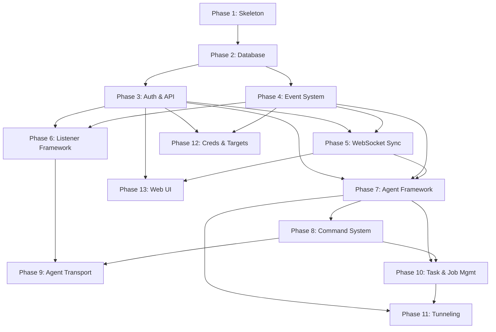

# ExecuteC2 — Implementation Plan

## Phase Dependency Graph

---

## Phase 1: Project Skeleton [depends on: none]

### Goal
The project has a valid Python package structure, all dependencies installable, and a CLI entry point that prints version and exits.

### Files to Create/Modify

- `pyproject.toml` — Project metadata, dependencies, entry point
- `src/executec2/__init__.py` — Package init with `__version__`
- `src/executec2/__main__.py` — CLI entry point (argparse)
- `src/executec2/server/__init__.py` — Empty
- `src/executec2/server/app.py` — Stub FastAPI app factory
- `src/executec2/config/__init__.py` — Empty
- `src/executec2/config/schema.py` — Pydantic config models (see [06_CONFIG_SPEC.md](06_CONFIG_SPEC.md))
- `tests/conftest.py` — Base pytest fixtures
- `tests/unit/__init__.py` — Empty
- `tests/integration/__init__.py` — Empty

### Steps

1. Create `pyproject.toml` with `[project]` metadata, all dependencies from [01_ARCHITECTURE.md#technology-stack](01_ARCHITECTURE.md#technology-stack), `[project.scripts]` entry point `executec2 = "executec2.__main__:main"`.
   - Validation: `uv pip install -e .` succeeds
2. Create directory tree: `src/executec2/`, `src/executec2/server/`, `src/executec2/config/`, `src/executec2/listeners/`, `src/executec2/agents/`, `src/executec2/commands/`, `src/executec2/commands/builtin/`, `src/executec2/tunnels/`, `agent/`, `agent/commands/`, `tests/unit/`, `tests/integration/`, `docker/`. Add `__init__.py` to each Python package.
   - Validation: `python -c "import executec2"` succeeds
3. Implement `src/executec2/config/schema.py` — `ExecuteC2Config`, `ServerConfig`, `PluginConfig`, `LoggingConfig` Pydantic models with validators per [06_CONFIG_SPEC.md](06_CONFIG_SPEC.md).
   - Validation: Unit test loads a sample `config.yaml` and validates
4. Implement `src/executec2/__main__.py` — argparse CLI with `--config`, `--debug`, `--host`, `--port` flags. Loads config, prints version, exits (no server yet).
   - Validation: `python -m executec2 --help` prints usage
5. Create `tests/conftest.py` with `tmp_path` fixture for temporary data directories.
   - Validation: `pytest tests/` passes (0 tests collected, no errors)

### Exit Criteria

- [ ] `uv pip install -e .` completes without errors
- [ ] `python -m executec2 --help` prints CLI usage
- [ ] `pytest tests/` exits cleanly
- [ ] Config schema validates a sample YAML file

---

## Phase 2: Database Layer [depends on: Phase 1]

### Goal
All SQLite tables exist, CRUD operations work for every model, and the database initializes in WAL mode with correct pragmas.

### Files to Create/Modify

- `src/executec2/server/database.py` — aiosqlite connection, schema creation, CRUD methods
- `src/executec2/server/models.py` — All Pydantic models from [02_DATA_MODELS.md](02_DATA_MODELS.md)
- `tests/unit/test_database.py` — CRUD tests for every table

### Steps

1. Implement `src/executec2/server/models.py` — All Pydantic models: `AgentData`, `TaskData`, `ListenerData`, `CredentialData`, `TargetData`, `TunnelData`, `DownloadData`, `ChatMessage`, `OperatorData`, `OTPEntry`, `BrokerMessage`, `SyncPacketType`, `AgentMark`, `OSType`, `TaskType`, `MessageType`, `ListenerStatus`, `CredentialType`, `TunnelType`, `DownloadState`, `BrokerMsgType`.
   - Validation: Models can be instantiated with sample data
2. Implement `Database` class in `server/database.py`:
   - `Database.create(db_path)` — async classmethod, opens aiosqlite, sets WAL mode, busy_timeout=10000, cache_size=-64000
   - `Database.migrate()` — executes all CREATE TABLE IF NOT EXISTS statements from [02_DATA_MODELS.md#sqlite-schema](02_DATA_MODELS.md#sqlite-schema)
   - `Database.close()` — closes connection
   - Validation: DB file created, tables exist via `sqlite_master` query
3. Implement agent CRUD: `agent_insert(AgentData)`, `agent_get(id)`, `agent_list()`, `agent_update(id, **fields)`, `agent_delete(id)`.
   - Validation: Round-trip insert → get returns same data
4. Implement task CRUD: `task_insert(TaskData)`, `task_get(task_id)`, `task_list(agent_id)`, `task_update(task_id, **fields)`, `task_delete(task_id)`.
   - Validation: Unit tests pass
5. Implement listener CRUD: `listener_insert(ListenerData)`, `listener_get(name)`, `listener_list()`, `listener_update(name, **fields)`, `listener_delete(name)`.
   - Validation: Unit tests pass
6. Implement credential CRUD: `credential_insert(CredentialData)`, `credential_get(cred_id)`, `credential_list()`, `credential_update(cred_id, **fields)`, `credential_delete(cred_id)`.
   - Validation: Unit tests pass
7. Implement target CRUD: `target_insert(TargetData)`, `target_get(target_id)`, `target_list()`, `target_update(target_id, **fields)`, `target_delete(target_id)`.
   - Validation: Unit tests pass
8. Implement remaining CRUD: downloads, chat, consoles.
   - Validation: Unit tests pass

### Exit Criteria

- [ ] All 8 tables created via `migrate()`
- [ ] CRUD for agents, tasks, listeners, credentials, targets, downloads, chat, consoles all pass unit tests
- [ ] WAL mode confirmed via `PRAGMA journal_mode` query
- [ ] Foreign key cascades work (delete agent → deletes its tasks)

---

## Phase 3: Auth & HTTP API [depends on: Phase 2]

### Goal
FastAPI app serves HTTPS, JWT login/refresh works, and all route stubs exist behind auth middleware.

### Files to Create/Modify

- `src/executec2/server/app.py` — FastAPI app factory with lifespan, TLS config
- `src/executec2/server/auth.py` — `JWTManager`, password verification, rate limiting, OTP store
- `src/executec2/server/routes/__init__.py` — Router aggregation
- `src/executec2/server/routes/agents.py` — Agent route stubs
- `src/executec2/server/routes/listeners.py` — Listener route stubs
- `src/executec2/server/routes/tasks.py` — Task route stubs
- `src/executec2/server/routes/credentials.py` — Credential routes
- `src/executec2/server/routes/targets.py` — Target routes
- `src/executec2/server/routes/tunnels.py` — Tunnel route stubs
- `src/executec2/server/routes/sync.py` — Sync/subscribe route stubs
- `tests/unit/test_auth.py` — JWT and auth tests
- `tests/integration/test_api_auth.py` — Login/refresh integration test

### Steps

1. Implement `JWTManager` in `server/auth.py`:
   - `__init__()` — generate 32-byte random HMAC key via `secrets.token_bytes(32)`
   - `create_access_token(username)` → JWT with exp, iat, username, token_type="access"
   - `create_refresh_token(username)` → JWT with longer exp, token_type="refresh"
   - `verify_token(token, expected_type)` → `TokenClaims` or raises
   - `verify_password(username, password, operators)` → bool (SHA256 compare)
   - Validation: Unit test — create token → verify → get claims
2. Implement OTP store in `server/auth.py`:
   - `OTPStore` class with `generate(username, otp_type)`, `validate(otp)` methods
   - In-memory dict, 60-second TTL, single-use
   - Validation: Unit test — generate → validate once → second validate fails
3. Implement rate limiter in `server/auth.py`:
   - `RateLimiter` class tracking attempts per IP with sliding window
   - Validation: Unit test — exceed limit → returns False
4. Implement `create_app()` in `server/app.py`:
   - FastAPI lifespan: init DB, JWT, broker, event manager
   - Include all route routers
   - JWT dependency: `get_current_user` extracts and verifies Bearer token
   - Validation: App starts without errors
5. Implement `/api/auth/login`, `/api/auth/refresh`, `/api/auth/otp` in routes.
   - Validation: Integration test — httpx AsyncClient login → get tokens → refresh
6. Add route stubs for all endpoints in [03_API_REFERENCE.md](03_API_REFERENCE.md) (return 501 for now).
   - Validation: Every endpoint returns 501 or correct response

### Exit Criteria

- [ ] `POST /api/auth/login` returns JWT tokens for valid credentials
- [ ] `POST /api/auth/refresh` rotates tokens
- [ ] Invalid credentials return 401
- [ ] Rate limiting returns 429 after threshold
- [ ] All route stubs registered and return responses
- [ ] JWT dependency rejects requests without valid tokens

---

## Phase 4: Event System [depends on: Phase 2]

### Goal
EventManager processes pre/post hooks with correct timeouts, cancellation, and priority ordering.

### Files to Create/Modify

- `src/executec2/server/events.py` — `EventManager`, `EventHook`, `HookPhase` (see [05_AGENT_SPEC.md#eventmanager](05_AGENT_SPEC.md#eventmanager))
- `tests/unit/test_events.py` — Hook registration, execution, timeout, cancellation tests

### Steps

1. Implement `EventManager` class per [05_AGENT_SPEC.md](05_AGENT_SPEC.md):
   - `register(hook)` — insert by priority
   - `emit(event_type, data)` — run pre-hooks synchronously, 5s timeout, return False if cancelled
   - `emit_async(event_type, data)` — queue post-hooks
   - `start()` — spawn worker tasks
   - `stop()` — cancel worker tasks
   - Validation: Unit test — register hook, emit, verify callback called
2. Test pre-hook cancellation:
   - Register hook returning False → `emit()` returns False
   - Validation: Cancellation prevents operation
3. Test priority ordering:
   - Register hooks with different priorities → verify execution order
4. Test timeout behavior:
   - Register slow hook (>5s) → verify it's skipped with warning

### Exit Criteria

- [ ] Pre-hooks execute synchronously with 5s timeout
- [ ] Pre-hooks can cancel operations
- [ ] Post-hooks execute asynchronously via worker pool
- [ ] Priority ordering respected
- [ ] All event types from [05_AGENT_SPEC.md](05_AGENT_SPEC.md) are accepted

---

## Phase 5: WebSocket Sync [depends on: Phase 3, Phase 4]

### Goal
Operators can connect via WebSocket, receive sync data, subscribe to categories, and receive realtime broadcasts.

### Files to Create/Modify

- `src/executec2/server/broker.py` — `MessageBroker`, `ClientHandler` (see [02_DATA_MODELS.md](02_DATA_MODELS.md))
- `src/executec2/server/routes/sync.py` — WebSocket endpoint, subscribe endpoint
- `tests/unit/test_broker.py` — Broker broadcast, backpressure tests
- `tests/integration/test_websocket.py` — Full WebSocket sync flow

### Steps

1. Implement `ClientHandler` per [02_DATA_MODELS.md#client-handler](02_DATA_MODELS.md#client-handler):
   - `send_queue`, `sync_queue`, `subscriptions`, `synced` flag, `state_store`
   - Validation: Instantiation works
2. Implement `MessageBroker`:
   - `register(client)` / `unregister(client)`
   - `broadcast(message)` — fan out to subscribed clients with backpressure
   - `start()` / `stop()` — run broadcast loop as asyncio task
   - Backpressure: warn at 75%, drop at 95%, disconnect at 100%
   - State messages: last-write-wins per `state_key`
   - Validation: Unit test — register client, broadcast, verify received
3. Implement WebSocket endpoint `GET /api/sync/ws?otp={otp}`:
   - Validate OTP, upgrade to WebSocket
   - Send `SYNC_START`, category batches from DB, `SYNC_FINISH`
   - Start send loop forwarding from `send_queue`
   - Validation: Integration test with httpx WebSocket
4. Implement `POST /api/sync/subscribe`:
   - Add categories to client's subscription set
   - Send presync batch for each new category
   - Validation: Subscribe → receive category batch

### Exit Criteria

- [ ] WebSocket connects with valid OTP
- [ ] Sync sequence (START → batches → FINISH) correct
- [ ] Subscriptions filter events to correct clients
- [ ] Backpressure warning logged at 75% fill
- [ ] State messages deduplicate per state_key

---

## Phase 6: Listener Framework [depends on: Phase 3, Phase 4]

### Goal
The plugin loader discovers and loads listener plugins, and the HTTP listener accepts connections and returns configured responses.

### Files to Create/Modify

- `src/executec2/listeners/__init__.py` — `PluginLoader` for listeners
- `src/executec2/listeners/base.py` — `ListenerPlugin` ABC (see [05_AGENT_SPEC.md](05_AGENT_SPEC.md))
- `src/executec2/listeners/http_listener.py` — HTTP/S listener implementation
- `src/executec2/server/routes/listeners.py` — Implement listener CRUD routes
- `tests/unit/test_http_listener.py` — Listener config validation, start/stop
- `tests/integration/test_listener_api.py` — Create/stop listener via API

### Steps

1. Implement `ListenerPlugin` ABC in `listeners/base.py` per [05_AGENT_SPEC.md#listenerplugin](05_AGENT_SPEC.md#listenerplugin).
   - Validation: Cannot instantiate abstract class
2. Implement `PluginLoader` in `listeners/__init__.py`:
   - `load_listeners(module_paths)` — importlib.import_module, find ListenerPlugin subclass
   - `get_listener_class(type_name)` → ListenerPlugin class
   - Validation: Loads `http_listener` module
3. Implement `HTTPListener` in `listeners/http_listener.py`:
   - `start(config, teamserver)` — create asyncio HTTP server, bind to config address/port
   - Request handler: validate URI, Host, User-Agent; parse beat header; route to teamserver
   - Response handler: embed payload in HTML template
   - `stop()` — close server
   - `pause()` / `resume()` — toggle paused flag
   - `validate_config()` — validate `HTTPListenerConfig`
   - Validation: Start listener, send HTTP request, get HTML response
4. Implement listener CRUD routes (`server/routes/listeners.py`):
   - `POST /api/listeners` — validate config, instantiate, start, DB insert, broadcast
   - `PUT /api/listeners/{name}` — update config
   - `POST /api/listeners/{name}/stop` — stop, update DB, broadcast
   - `POST /api/listeners/{name}/pause` / `resume`
   - `GET /api/listeners` — list from DB
   - Validation: Integration test — create listener via API, verify running

### Exit Criteria

- [ ] PluginLoader discovers HTTPListener from module path
- [ ] HTTP listener binds to configured port and accepts connections
- [ ] Non-matching requests receive `page_error` response
- [ ] Listener start/stop broadcasts WebSocket events
- [ ] Listener CRUD API works end-to-end

---

## Phase 7: Agent Framework [depends on: Phase 3, Phase 4, Phase 5]

### Goal
Agents can register, check in, and their lifecycle state machine works correctly. The tick updater runs and broadcasts heartbeats.

### Files to Create/Modify

- `src/executec2/agents/__init__.py` — Agent plugin loader
- `src/executec2/agents/base.py` — `AgentPlugin` ABC (see [05_AGENT_SPEC.md](05_AGENT_SPEC.md))
- `src/executec2/agents/python_agent.py` — `PythonAgentPlugin` implementation
- `src/executec2/server/routes/agents.py` — Implement agent routes
- `tests/unit/test_agent_lifecycle.py` — State machine tests
- `tests/integration/test_agent_api.py` — Agent CRUD via API

### Steps

1. Implement `AgentPlugin` ABC in `agents/base.py` per [05_AGENT_SPEC.md#agentplugin](05_AGENT_SPEC.md#agentplugin).
2. Implement `PythonAgentPlugin` in `agents/python_agent.py`:
   - `WATERMARK = "py01c2e0"`, `NAME = "python"`
   - `parse_beat()` — extract registration fields from msgpack beat
   - `get_commands()` — return command table from [05_AGENT_SPEC.md#built-in-commands](05_AGENT_SPEC.md#built-in-commands)
   - `build_task()` / `process_response()` — stub implementations
   - Validation: Plugin instantiates, commands list matches spec
3. Implement server-side `Agent` class (runtime container):
   - `pending_tasks`, `pending_tunnel_tasks`, `pending_tunnel_data` queues
   - `running_tasks`, `running_jobs` dicts
   - `tick`, `active` flags
   - Validation: Agent can be created with sample AgentData
4. Implement `agent_checkin()` in teamserver core:
   - New agent → DB insert, broadcast AGENT_NEW, emit "agent.new"
   - Known agent → update last_tick, set tick=True
   - Validation: Unit test — checkin creates agent in DB
5. Implement `agent_tick_updater()` per [05_AGENT_SPEC.md#tick-updater](05_AGENT_SPEC.md#tick-updater):
   - 800ms loop, broadcast AGENT_TICK, detect inactive agents
   - Validation: Agent becomes inactive after 3× sleep with no check-in
6. Implement agent routes (`server/routes/agents.py`):
   - `GET /api/agents` — list
   - `DELETE /api/agents/{id}` — remove
   - `PUT /api/agents/{id}/tag`, `/mark`, `/color` — update fields
   - Validation: Integration tests pass

### Exit Criteria

- [ ] Agent registration via check-in creates DB record and broadcasts
- [ ] Tick updater marks agents inactive after timeout
- [ ] Inactive agents reactivate on check-in
- [ ] Agent state transitions match [05_AGENT_SPEC.md](05_AGENT_SPEC.md) state machine
- [ ] Agent CRUD API works

---

## Phase 8: Command System [depends on: Phase 7]

### Goal
Commands can be registered, dispatched to agents, and pre/post hooks fire correctly.

### Files to Create/Modify

- `src/executec2/commands/__init__.py` — Package init
- `src/executec2/commands/registry.py` — `CommandRegistry`, `CommandDef`, `ArgumentDef` (see [05_AGENT_SPEC.md#command-registry](05_AGENT_SPEC.md#command-registry))
- `src/executec2/commands/builtin/__init__.py` — Register all built-in commands
- `src/executec2/server/routes/agents.py` — Implement command execution endpoint
- `tests/unit/test_commands.py` — Registry and dispatch tests

### Steps

1. Implement `CommandRegistry` per [05_AGENT_SPEC.md](05_AGENT_SPEC.md):
   - `register(agent_type, command)`, `get(agent_type, name)`, `list_commands(agent_type)`
   - Validation: Register → get returns same command
2. Register all built-in commands from [05_AGENT_SPEC.md#built-in-commands](05_AGENT_SPEC.md#built-in-commands) in `commands/builtin/__init__.py`.
   - Validation: `list_commands("python")` returns all 19 commands
3. Implement `POST /api/agents/{id}/commands`:
   - Look up command in registry
   - Fire pre-hook via EventManager
   - Call `plugin.build_task()` to create task payload
   - Insert task in DB, enqueue in agent's pending_tasks
   - Broadcast AGENT_TASK_SEND
   - Fire post-hook async
   - Validation: Integration test — execute command, verify task created
4. Implement `POST /api/agents/{id}/commands/raw`:
   - Directly enqueue raw bytes
   - Validation: Unit test

### Exit Criteria

- [ ] All 19 built-in commands registered
- [ ] Command execution creates task and enqueues it
- [ ] Pre-hooks can cancel command execution
- [ ] Unknown commands return 400
- [ ] Task appears in `GET /api/agents/{id}/tasks`

---

## Phase 9: Agent Transport [depends on: Phase 6, Phase 8]

### Goal
The Python agent payload can connect to the HTTP listener, register, receive tasks, execute them, and return results.

### Files to Create/Modify

- `agent/__init__.py` — Package init
- `agent/main.py` — Agent main loop (see [05_AGENT_SPEC.md#agent-main-loop](05_AGENT_SPEC.md#agent-main-loop))
- `agent/connector_http.py` — HTTP/S connector (see [05_AGENT_SPEC.md#connector-interface](05_AGENT_SPEC.md#connector-interface))
- `agent/crypto.py` — AES-GCM encryption (see [04_PROTOCOL_SPEC.md#encryption-scheme](04_PROTOCOL_SPEC.md#encryption-scheme))
- `agent/commands/__init__.py` — Command handler dispatch table
- `tests/integration/test_agent_checkin.py` — End-to-end agent check-in

### Steps

1. Implement `agent/crypto.py`:
   - `AgentCrypto.__init__(master_key_hex, agent_id)` — derive session_key and beat_key via HKDF-SHA256
   - `encrypt(plaintext)` → `nonce + ciphertext + tag`
   - `decrypt(data)` → plaintext
   - Validation: Encrypt → decrypt round-trip
2. Implement `agent/connector_http.py`:
   - `HTTPConnector.__init__(config)` — parse callback addresses, URIs, headers
   - `send_checkin(beat_header_value, body)` → response body bytes
   - Server selection rotation, exponential backoff on failure
   - Validation: Unit test with mocked HTTP server
3. Implement `agent/main.py`:
   - `Agent.__init__(config)` — generate agent_id, init connector + crypto
   - `register()` — build registration beat, send via connector
   - `check_in()` — send results, receive tasks, dispatch
   - `execute_task(task)` — look up handler, execute, collect result
   - `sleep_with_jitter()` — sleep ± jitter
   - Validation: Agent starts, registers with test listener
4. Implement command handlers in `agent/commands/__init__.py`:
   - `COMMAND_HANDLERS` dict mapping command ID → async handler function
   - Implement: pwd, cd, ls, cat, mkdir, rm, mv, cp, whoami, exec, shell, ps, kill, upload, download, config, jobs, jobkill, exit
   - Validation: Individual handler unit tests
5. Integration test: start HTTP listener + run agent → agent registers → send command → agent returns result.
   - Validation: End-to-end flow completes

### Exit Criteria

- [ ] AES-GCM encrypt/decrypt round-trips correctly
- [ ] HKDF key derivation matches between agent and listener
- [ ] Agent registers with HTTP listener
- [ ] Agent receives and executes commands
- [ ] Agent returns results in next check-in
- [ ] Kill date terminates agent

---

## Phase 10: Task & Job Management [depends on: Phase 7, Phase 8]

### Goal
Tasks route correctly by type, background jobs have lifecycle management, and task state persists correctly.

### Files to Create/Modify

- `src/executec2/server/routes/tasks.py` — Implement task routes
- `tests/unit/test_task_manager.py` — Task routing tests
- `tests/integration/test_task_lifecycle.py` — Full task lifecycle test

### Steps

1. Implement task type routing:
   - TaskType.TASK → standard task queue
   - TaskType.JOB → running_jobs dict (long-running, cancellable)
   - TaskType.TUNNEL → tunnel task queue
   - Validation: Tasks route to correct queue
2. Implement `GET /api/agents/{id}/tasks`:
   - Return all tasks for agent from DB
   - Validation: API returns correct tasks
3. Implement `POST /api/agents/{id}/tasks/{task_id}/cancel`:
   - Remove from pending queue or mark cancelled
   - Broadcast AGENT_TASK_REMOVE
   - Validation: Cancelled task no longer delivered to agent
4. Implement `DELETE /api/agents/{id}/tasks/{task_id}`:
   - Delete from DB
   - Broadcast AGENT_TASK_REMOVE
   - Validation: Task deleted
5. Implement task completion flow:
   - Agent response → `plugin.process_response()` → update DB → broadcast AGENT_TASK_UPDATE
   - Job updates: partial progress updates for long-running tasks
   - Validation: Integration test — execute → complete → verify status

### Exit Criteria

- [ ] Standard tasks enqueue and dequeue correctly
- [ ] Background jobs tracked in running_jobs
- [ ] Task cancellation prevents delivery
- [ ] Completed tasks stored in DB with output
- [ ] Task CRUD API works

---

## Phase 11: Tunneling [depends on: Phase 7, Phase 10]

### Goal
SOCKS5 proxy and local port forwarding work through agents.

### Files to Create/Modify

- `src/executec2/tunnels/__init__.py` — Package init
- `src/executec2/tunnels/socks5.py` — SOCKS5 server, `TunnelManager`
- `src/executec2/server/routes/tunnels.py` — Implement tunnel routes
- `agent/commands/__init__.py` — Add tunnel command handlers
- `tests/unit/test_socks5.py` — SOCKS5 handshake tests
- `tests/integration/test_tunnel.py` — Tunnel flow test

### Steps

1. Implement `TunnelManager`:
   - Track active tunnels (tunnel_id → TunnelData)
   - Manage asyncio servers for local SOCKS5/portfwd listeners
   - Route tunnel data to/from agent pending_tunnel_data queue
   - Validation: Manager tracks tunnels correctly
2. Implement SOCKS5 server in `tunnels/socks5.py`:
   - Handshake: version negotiation, auth (optional), CONNECT request
   - Per-connection `channel_id` assigned
   - Data relay: SOCKS client ↔ tunnel_data queue ↔ agent ↔ target
   - Validation: SOCKS5 handshake completes
3. Implement local port forwarding:
   - Open local `asyncio.start_server()` on configured lhost:lport
   - Each connection → tunnel packet {action: connect, thost, tport}
   - Data relay through agent
   - Validation: Port forward connects
4. Implement tunnel routes:
   - `POST /api/tunnels/socks5` — create SOCKS5 tunnel
   - `POST /api/tunnels/lportfwd` — create port forward
   - `POST /api/tunnels/{id}/stop` — stop tunnel
   - `PUT /api/tunnels/{id}/info` — update info
   - `GET /api/tunnels` — list tunnels
   - Validation: API creates and lists tunnels
5. Add tunnel command handlers in agent (`agent/commands/`):
   - Handle tunnel connect/data/close packets
   - Open TCP connection to target, relay data
   - Validation: Agent-side tunnel connect works

### Exit Criteria

- [ ] SOCKS5 handshake works (no-auth and username/password)
- [ ] Data flows through SOCKS5 proxy via agent
- [ ] Local port forwarding connects through agent
- [ ] Tunnel lifecycle (create/stop) works via API
- [ ] Tunnel data queued correctly alongside regular tasks

---

## Phase 12: Credential & Target Management [depends on: Phase 3, Phase 4]

### Goal
Credentials and targets can be created, edited, deleted via API, with events broadcast on changes.

### Files to Create/Modify

- `src/executec2/server/routes/credentials.py` — Implement credential routes
- `src/executec2/server/routes/targets.py` — Implement target routes
- `tests/unit/test_credentials.py` — Credential CRUD + encryption tests
- `tests/unit/test_targets.py` — Target CRUD tests

### Steps

1. Implement credential at-rest encryption:
   - Derive credential encryption key from server master secret via HKDF
   - Encrypt `secret` field before DB insert, decrypt on read
   - Validation: Insert → read returns correct plaintext
2. Implement credential routes per [03_API_REFERENCE.md#credentials](03_API_REFERENCE.md#credentials):
   - CRUD + tag update
   - Emit events: credential.add, credential.edit, credential.remove
   - Broadcast: CREDS_CREATE, CREDS_UPDATE, CREDS_DELETE
   - Validation: Integration test
3. Implement target routes per [03_API_REFERENCE.md#targets](03_API_REFERENCE.md#targets):
   - CRUD + tag update
   - Emit events: target.add, target.edit, target.remove
   - Broadcast: TARGETS_CREATE, TARGETS_UPDATE, TARGETS_DELETE
   - Validation: Integration test
4. Implement chat route:
   - `POST /api/chat` — insert message, broadcast CHAT_MESSAGE
   - Validation: Message appears in chat history

### Exit Criteria

- [ ] Credential secrets encrypted at rest in DB
- [ ] Credential CRUD API works with encryption/decryption
- [ ] Target CRUD API works
- [ ] Events emitted for all credential/target changes
- [ ] WebSocket broadcasts sent for all changes

---

## Phase 13: Web UI [depends on: Phase 3, Phase 5]

### Goal
A minimal operator dashboard serves from the teamserver for basic operations.

### Files to Create/Modify

- (Deferred — web UI is out of v1.0 scope per design decision)

### Steps

1. This phase is deferred to v2.0. The REST API and WebSocket protocol from Phases 3–12 provide the complete operator interface. A CLI client or third-party web UI can connect using the documented API.

### Exit Criteria

- [ ] Deferred — no deliverables for v1.0
