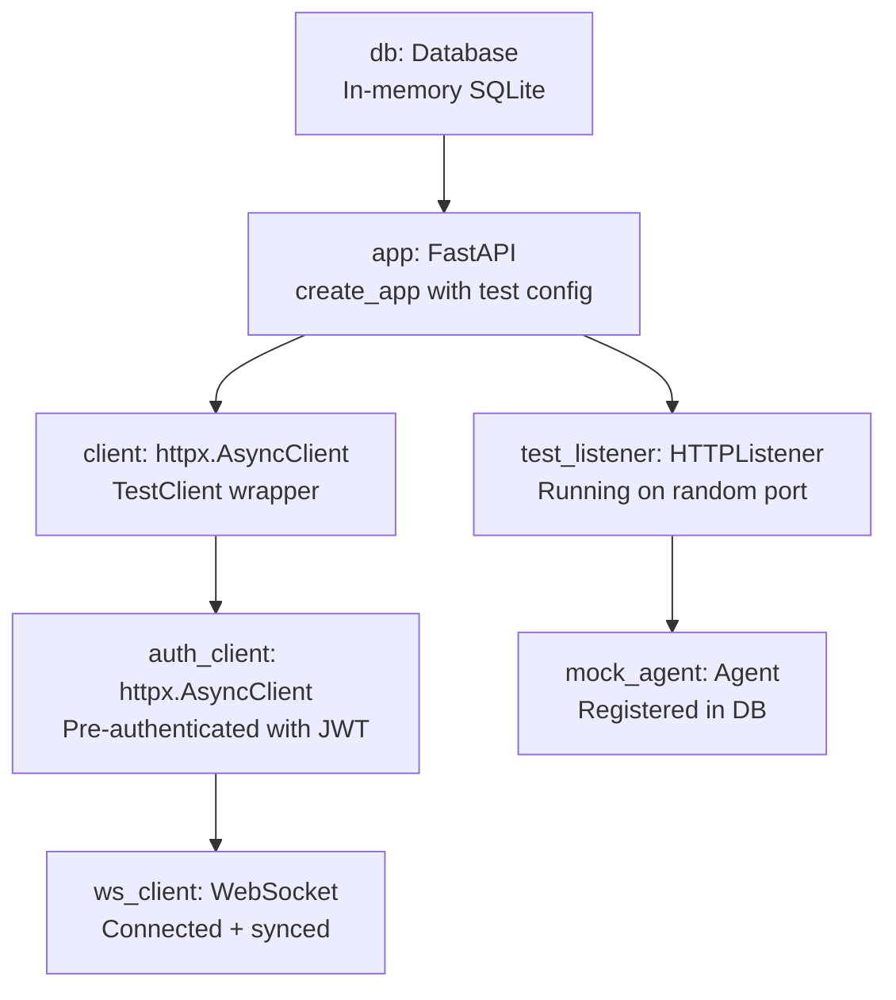

# ExecuteC2 — Test Spec

## Testing Stack

- **Framework:** pytest >= 8.3
- **Async:** pytest-asyncio >= 0.24 in `auto` mode
- **HTTP client:** httpx AsyncClient with FastAPI TestClient
- **Coverage target:** 80%+ server core, 60%+ agent payload

## Configuration

```toml
# pyproject.toml
[tool.pytest.ini_options]
asyncio_mode = "auto"
testpaths = ["tests"]
markers = [
    "unit: unit tests",
    "integration: integration tests",
]

[tool.coverage.run]
source = ["src/executec2", "agent"]
branch = true

[tool.coverage.report]
fail_under = 70
```

## Test Directory Layout

```
tests/
├── conftest.py                    # Shared fixtures
├── unit/
│   ├── __init__.py
│   ├── test_models.py             # Pydantic model validation
│   ├── test_database.py           # CRUD operations
│   ├── test_auth.py               # JWT, password, rate limiter, OTP
│   ├── test_events.py             # EventManager hooks
│   ├── test_broker.py             # MessageBroker + backpressure
│   ├── test_commands.py           # CommandRegistry + dispatch
│   ├── test_http_listener.py      # HTTPListener config + handlers
│   ├── test_agent_lifecycle.py    # State machine transitions
│   ├── test_task_manager.py       # Task routing by type
│   ├── test_socks5.py             # SOCKS5 handshake parsing
│   ├── test_credentials.py        # Credential encryption
│   ├── test_targets.py            # Target CRUD
│   └── test_agent_crypto.py       # AES-GCM + HKDF
├── integration/
│   ├── __init__.py
│   ├── test_api_auth.py           # Login/refresh/OTP flow
│   ├── test_listener_api.py       # Listener CRUD via API
│   ├── test_agent_api.py          # Agent CRUD via API
│   ├── test_websocket.py          # WebSocket sync flow
│   ├── test_agent_checkin.py      # Agent ↔ listener ↔ teamserver
│   ├── test_task_lifecycle.py     # Command → task → result
│   ├── test_tunnel.py             # SOCKS5 + portfwd flow
│   └── test_credential_api.py     # Credential + target API
└── conftest.py
```

## Fixture Hierarchy



### Fixture Implementations (`tests/conftest.py`)

```python
import pytest
import pytest_asyncio
from httpx import AsyncClient, ASGITransport
from executec2.server.app import create_app
from executec2.server.database import Database
from executec2.config.schema import ExecuteC2Config


@pytest_asyncio.fixture
async def db(tmp_path):
    """In-memory SQLite database with schema migrated."""
    database = await Database.create(":memory:")
    await database.migrate()
    yield database
    await database.close()


@pytest.fixture
def test_config(tmp_path):
    """Minimal test configuration."""
    cert = tmp_path / "cert.pem"
    key = tmp_path / "key.pem"
    # Generate self-signed cert for testing
    _generate_self_signed_cert(cert, key)
    return ExecuteC2Config(
        server={"host": "127.0.0.1", "port": 0, "data_dir": str(tmp_path),
                "tls_cert": str(cert), "tls_key": str(key)},
        operators={"testuser": "testpass"},
    )


@pytest_asyncio.fixture
async def app(db, test_config):
    """FastAPI app with test database injected."""
    application = create_app(test_config, db_override=db)
    yield application


@pytest_asyncio.fixture
async def client(app):
    """Unauthenticated HTTP client."""
    transport = ASGITransport(app=app)
    async with AsyncClient(transport=transport, base_url="https://test") as c:
        yield c


@pytest_asyncio.fixture
async def auth_client(client):
    """Authenticated HTTP client with JWT token."""
    resp = await client.post("/api/auth/login", json={
        "username": "testuser", "password": "testpass",
    })
    token = resp.json()["access_token"]
    client.headers["Authorization"] = f"Bearer {token}"
    yield client


@pytest_asyncio.fixture
async def mock_agent(db):
    """An agent registered in the database."""
    from executec2.server.models import AgentData, OSType
    agent = AgentData(
        id="aabb1122", name="python", session_key=b"\x00" * 32,
        listener="test_http", sleep=60, jitter=20, os=OSType.LINUX,
    )
    await db.agent_insert(agent)
    return agent
```

## Mock Boundaries

| Layer | Unit Tests | Integration Tests |
|---|---|---|
| Database | In-memory SQLite (real) | In-memory SQLite (real) |
| FastAPI | Not started | Real app via ASGI transport |
| HTTP listener | Mocked (no real socket) | Real listener on random port |
| Agent connector | Mocked HTTP responses | Real HTTP against test listener |
| Crypto | Real (no mock) | Real (no mock) |
| EventManager | Real (no mock) | Real (no mock) |
| MessageBroker | Real (no mock) | Real (no mock) |
| File system | tmp_path fixture | tmp_path fixture |

## Test Scenarios by Phase

### Phase 1: Skeleton

```python
async def test_config_loads_valid_yaml(tmp_path):
    """Config schema validates a well-formed config.yaml."""

async def test_config_rejects_missing_tls():
    """Config schema raises ValidationError without TLS paths."""

async def test_cli_help(capsys):
    """--help prints usage and exits."""
```

### Phase 2: Database

```python
async def test_migrate_creates_all_tables(db):
    """All 8 tables exist after migrate()."""

async def test_agent_crud_roundtrip(db):
    """Insert agent → get → update → delete lifecycle."""

async def test_task_cascade_delete(db):
    """Deleting agent cascades to its tasks."""

async def test_credential_crud(db):
    """Insert → list → update → delete for credentials."""

async def test_wal_mode_enabled(db):
    """PRAGMA journal_mode returns 'wal'."""
```

### Phase 3: Auth & API

```python
async def test_login_valid_credentials(client):
    """POST /api/auth/login returns tokens for valid creds."""

async def test_login_invalid_password(client):
    """POST /api/auth/login returns 401 for bad password."""

async def test_refresh_token_rotation(auth_client):
    """POST /api/auth/refresh returns new token pair."""

async def test_rate_limiting(client):
    """Exceed rate limit → 429 response."""

async def test_jwt_required_on_protected_routes(client):
    """GET /api/agents without JWT returns 401."""

async def test_otp_generation_and_consumption(auth_client):
    """Generate OTP → use once → second use fails."""
```

### Phase 4: Event System

```python
async def test_pre_hook_cancels_operation():
    """Pre-hook returning False prevents event propagation."""

async def test_post_hook_executes_async():
    """Post-hook callback fires asynchronously."""

async def test_hook_priority_ordering():
    """Lower priority hooks execute first."""

async def test_pre_hook_timeout():
    """Slow pre-hook (>5s) is skipped."""

async def test_multiple_hooks_same_event():
    """Multiple hooks on same event all fire."""
```

### Phase 5: WebSocket Sync

```python
async def test_websocket_sync_sequence(auth_client):
    """Connect → receive SYNC_START → batches → SYNC_FINISH."""

async def test_subscription_filters_events(auth_client):
    """Only subscribed categories delivered."""

async def test_backpressure_warning(caplog):
    """Warning logged at 75% send_queue fill."""

async def test_state_message_dedup():
    """State messages deduplicate per state_key."""

async def test_presync_batch_on_subscribe(auth_client):
    """Subscribing sends historical data batch."""
```

### Phase 6: Listener Framework

```python
async def test_http_listener_starts_and_stops():
    """Listener binds port, accepts request, stops cleanly."""

async def test_listener_config_validation():
    """Invalid config raises ValueError."""

async def test_decoy_page_for_non_agent():
    """Non-agent request receives page_error HTML."""

async def test_listener_crud_api(auth_client):
    """Create → list → stop listener via API."""

async def test_plugin_loader_discovers_http():
    """PluginLoader finds HTTPListener class."""
```

### Phase 7: Agent Framework

```python
async def test_agent_registration(db):
    """First check-in creates agent in DB."""

async def test_tick_updater_marks_inactive(db):
    """Agent inactive after 3× sleep with no check-in."""

async def test_inactive_agent_reactivates(db):
    """Check-in clears inactive mark."""

async def test_agent_state_transitions():
    """All transitions in state machine are valid."""

async def test_agent_crud_api(auth_client, mock_agent):
    """List, update tag/mark/color, delete agent via API."""
```

### Phase 8: Command System

```python
async def test_command_registry_roundtrip():
    """Register command → get returns same CommandDef."""

async def test_all_builtin_commands_registered():
    """19 built-in commands present for 'python' agent type."""

async def test_command_execution_creates_task(auth_client, mock_agent):
    """POST /api/agents/{id}/commands creates task."""

async def test_unknown_command_returns_400(auth_client, mock_agent):
    """Unknown command name → 400 error."""

async def test_pre_hook_cancels_command(auth_client, mock_agent):
    """Pre-hook returning False → 409 response."""
```

### Phase 9: Agent Transport

```python
async def test_aes_gcm_roundtrip():
    """Encrypt → decrypt returns original plaintext."""

async def test_hkdf_key_derivation_deterministic():
    """Same inputs → same derived key."""

async def test_agent_registration_flow():
    """Agent sends registration beat → listener creates agent."""

async def test_agent_receives_and_executes_task():
    """Command sent → agent receives → executes → returns result."""

async def test_agent_exponential_backoff():
    """Connection failure triggers backoff."""

async def test_kill_date_terminates_agent():
    """Agent exits when kill_date is reached."""
```

### Phase 10: Task & Job Management

```python
async def test_task_type_routing():
    """TASK → pending_tasks, JOB → running_jobs, TUNNEL → tunnel queue."""

async def test_task_cancellation(auth_client, mock_agent):
    """Cancel task removes from pending queue."""

async def test_job_progress_updates():
    """Background job sends partial updates."""

async def test_completed_task_stored_in_db(db):
    """Task completion persists output to database."""
```

### Phase 11: Tunneling

```python
async def test_socks5_handshake_no_auth():
    """SOCKS5 greeting + CONNECT without auth."""

async def test_socks5_handshake_with_auth():
    """SOCKS5 greeting + auth + CONNECT."""

async def test_socks5_data_relay():
    """Data flows through SOCKS5 proxy."""

async def test_local_port_forward():
    """Portfwd connects and relays data."""

async def test_tunnel_stop_cleans_up():
    """Stopping tunnel closes all connections."""
```

### Phase 12: Credentials & Targets

```python
async def test_credential_at_rest_encryption(db):
    """Secret encrypted in DB, decrypted on read."""

async def test_credential_crud_api(auth_client):
    """Create → list → update → delete credential."""

async def test_target_crud_api(auth_client):
    """Create → list → update → delete target."""

async def test_credential_event_broadcast():
    """Credential changes broadcast via WebSocket."""

async def test_chat_message(auth_client):
    """POST /api/chat sends message and broadcasts."""
```

## Running Tests

```bash
# All tests
uv run pytest tests/ -v

# Unit tests only
uv run pytest tests/unit/ -v

# Integration tests only
uv run pytest tests/integration/ -v

# With coverage
uv run pytest tests/ --cov --cov-report=html

# Single test
uv run pytest tests/unit/test_database.py::test_agent_crud_roundtrip -v
```
